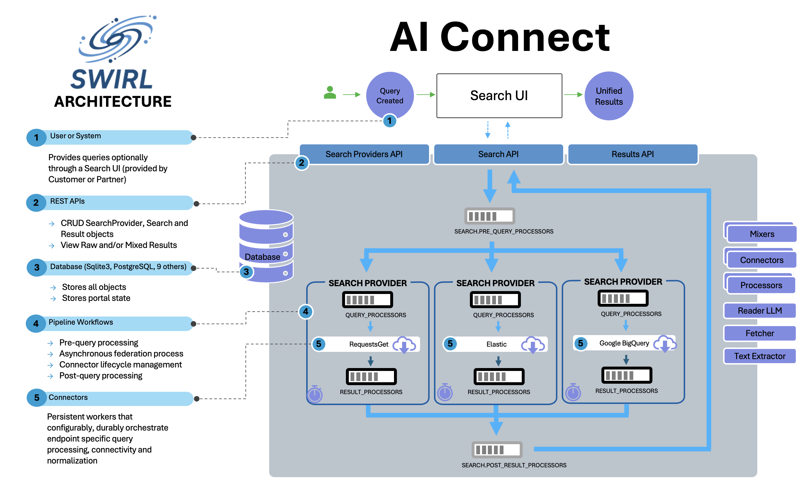
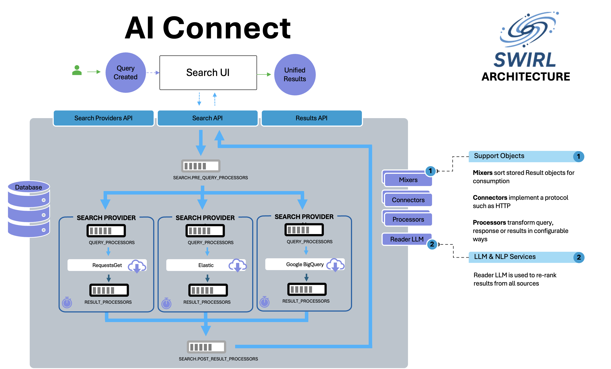
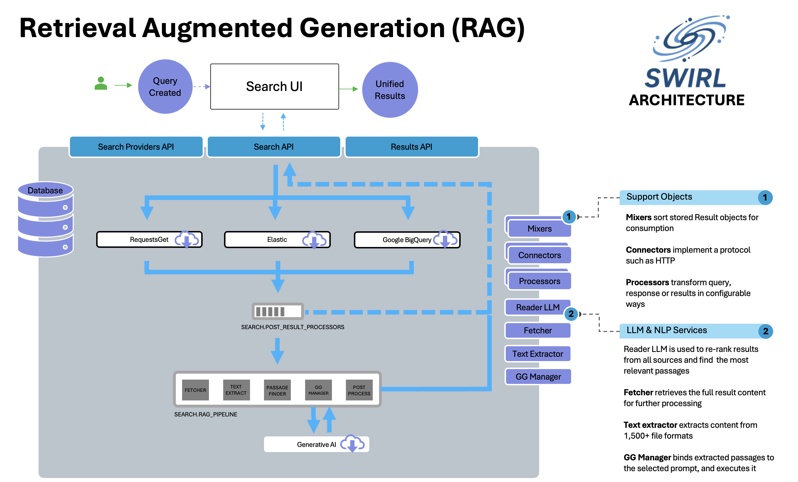
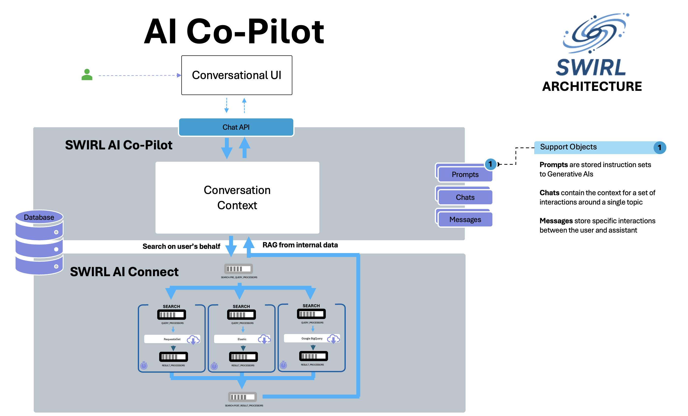
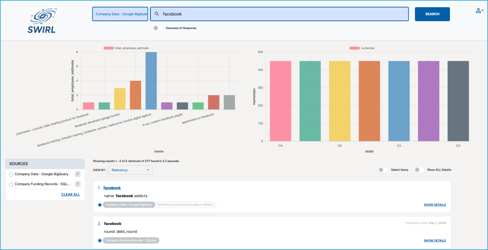

<details markdown="block">
  <summary>
    Table of Contents
  </summary>
  {: .text-delta }
- TOC
{:toc}
</details>

<span class="big-text">Developer Guide</span><br/><span class="med-text">Community Edition | Enterprise Edition</span>

---

# Glossary

| Term | Definition |
|------|-----------|
| **SearchProvider** | Defines a searchable source, including metadata and the connector type used for querying. |
| **Search** | Represents a query execution request, containing a `query_string` and optional metadata. |
| **Query** | Refers to the **search terms** entered by a user. SWIRL follows this terminology but may sometimes refer to searches as queries. |
| **Subscribe** | When `true`, SWIRL periodically re-runs the search, retrieving **newer** data and removing duplicates. |
| **Connector** | A SWIRL module that interacts with a **specific data source**, wrapping existing Python libraries (e.g., `requests.get`, `elasticsearch`). |
| **Processors** | Modules that process **search queries and results**, transforming them (e.g., removing control characters, spell-checking, or normalizing formats). |
| **Pipelines** | Execute pre-defined sequences of Processors to transform search or result content. |
| **Result** | Represents **retrieved search results** from one `SearchProvider` within a federated search. |
| **Mixer** | Combines results from multiple `SearchProviders` into a **unified result set**. |
| **Relevancy Ranking** | Estimates the importance of a search result compared to others. [Learn more](https://en.wikipedia.org/wiki/Relevance_(information_retrieval)). |

# Architecture

## SWIRL AI Connect




## SWIRL RAG Architecture


## SWIRL AI Co-Pilot


# Workflow

1. Creating a Search

    A new `Search` object is created at the `/swirl/search/` endpoint.

    - This calls the `create` method in [`swirl/views.py`](https://github.com/swirlai/swirl-search/blob/main/swirl/views.py).  
    - SWIRL responds with the `id` of the newly created search.  
    - The **federation process** is then managed by [`swirl/search.py`](https://github.com/swirlai/swirl-search/blob/main/swirl/search.py).

2. Executing the Search

    [`swirl/search.py`](https://github.com/swirlai/swirl-search/blob/main/swirl/search.py) performs:

    - **Pre-query processing** using `Search.pre_query_processors`.
    - **Federation** by creating a [`federate_task`](https://github.com/swirlai/swirl-search/blob/main/swirl/tasks.py) for each SearchProvider.

3. Waiting for Results

    - SWIRL waits for all tasks to complete **or** until `settings.SWIRL_TIMEOUT` is reached.  
    - Meanwhile, each `federate_task`:

        - Creates a **Connector**.
        - Processes the query using `Search.query_processors`.
        - Builds and validates the query (`url`, `query_template`, `query_mappings`).
        - Sends the query to the SearchProvider.
        - Normalizes and processes results (`Search.result_processors`).
        - Saves results in the database.

4. Post-Processing and Relevancy Ranking

    Once results are available (or the timeout occurs):

    - `search.py` invokes `Search.post_result_processors`.
    - **Relevancy ranking** and **duplicate detection** are applied.
    - The `Search.status` is updated to `FULL_RESULTS_READY` or `PARTIAL_RESULTS_READY`.

5. Retrieving Results

    To retrieve results, use `/swirl/results`:

    - **All result objects** are listed.
    - Individual results can be retrieved using their `id`.
    - Adding `search_id` groups results using the **Result Mixer**.

6. Continuous Updates with `subscribe`

    If `Search.subscribe = true`:

    - SWIRL will periodically **re-run the search**.
    - The **sort order is set to `date`**, fetching newer results.
    - **Merging and de-duplication** ensure no duplicate results.

To retrieve only new results, use `Search.new_results_url` or select a **NewItem Mixer**.

# How To...

## Work with JSON Endpoints

When using a browser to interact with SWIRL API endpoints (such as those in this guide), **disable prefetching** to prevent accidental creation of multiple objects via `?q=` and `?qs=` parameters.

- [Disable Chrome prediction service](https://www.ghacks.net/2019/04/23/missing-chromes-use-a-prediction-service-setting/)
- [Disable Safari prefetch](https://stackoverflow.com/questions/29214246/how-to-turn-off-safaris-prefetch-feature)

## Create a Search Object via API

1. Navigate to: [http://localhost:8000/swirl/search/](http://localhost:8000/swirl/search/)

   

2. Scroll to the form at the bottom of the page.
3. Switch to **Raw data** mode and clear any pre-filled content.
4. Copy and paste an example Search object.
5. Click **POST**.

SWIRL responds with the newly created Search object, including its **`id`**:

   

{: .highlight }
**Save the `id` value**—it is required for retrieving **ranked results**.

## Create a Search Object with the `q=` URL Parameter

To create a Search object with only a `query_string` (and default settings), append `?q=your-query-string` to the API URL.

**Example:**  
[http://localhost:8000/swirl/search?q=knowledge+management](http://localhost:8000/swirl/search?q=knowledge+management)

After a few seconds, SWIRL redirects to the **fully mixed results page**:

  


**Limitations of `q=`:**

- The **query must be URL-encoded** (e.g., spaces → `+`). Use a [free URL encoder](https://www.freeformatter.com/url-encoder.html) for assistance.
- **All active and default SearchProviders are queried**.
- **Limited error handling**—if no results appear, inspect the Search object:  
  `http://localhost:8000/swirl/search/<your-search-id>`

## Specify SearchProviders with `providers=` URL Parameter

Use the `providers=` parameter to specify a **single** SearchProvider or a **list of Tags**.

**Example: Querying a single provider**  
```
http://localhost:8000/swirl/search/?q=knowledge+management&providers=maritime
```

**Example: Querying multiple providers by Tag**  
```
http://localhost:8000/swirl/search/?q=knowledge+management&providers=maritime,news
```

## Get Synchronous Results with `qs=` URL Parameter

The `qs=` parameter functions like `q=`, except that it **immediately returns the first page of results** instead of redirecting.

**Example:**  
[http://localhost:8000/swirl/search?qs=knowledge+management](http://localhost:8000/swirl/search?qs=knowledge+management)

**`qs=` Supports:**
- **Filtering by SearchProviders** using [`providers=`](#specify-searchproviders-with-providers-url-parameter).
- **Using custom Mixers** via [`result_mixer=`](Developer-Reference.html#mixers-1).
- **Enabling RAG processing** in a single call:  
  `?qs=metasearch&rag=true`

**Overriding RAG Timeout**

Starting in **SWIRL 3.7.0**, you can override the default **AI Summary timeout**:

**Example:**  
`http://localhost:8000/galaxy/?q=gig%20economics&rag=true&rag_timeout=90`  

{: .highlight }
**`rag_timeout` is specified in seconds.**

**Paging with `qs=`**

**`&page=` is NOT supported with `qs=`.**  

Instead, use the **`next_page` property** from the `info.results` structure:

```json
"results": {
    "retrieved_total": 30,
    "retrieved": 10,
    "federation_time": 2.2,
    "result_blocks": ["ai_summary"],
    "next_page": "http://localhost:8000/swirl/results/?search_id=2&page=2"
}
```

## Request Date-Sorted Results

If `"sort": "date"` is specified in a **Search object**, SWIRL will **request results in chronological order** from providers that support date sorting.  

However, by default, **SWIRL still applies relevancy ranking**, ensuring a mix of the most recent and most relevant results.

  


**Handling Missing Date Information**

Some sources **do not provide a `date_published` field**.  

To address this, use the **[DateFindingResultProcessor](#find-dates-in-bodytitle-responses)** to detect dates from content fields and map them to `date_published`.

## Use an LLM to Rewrite Queries

SWIRL AI Connect (Community Edition) supports **query rewriting** using `ChatGPTQueryProcessor`.

To enable it, add `"ChatGPTQueryProcessor"` to `SearchProvider.query_processors`.  

For details, see: [Developer Reference - Query Processors](Developer-Reference.html#query-processors).

## Adjust `swirl_score` for Starred Results in Galaxy UI

**SWIRL Community Edition  **
- Configured via `"theminimumSwirlScore"` in `static/api/config/default`.
- Default: `100`. Increase this to reduce starred results.

**SWIRL Enterprise Edition  **
- Configured via `"minimumConfidenceScore"` in `static/api/config/default`.
- Default: `0.7`. Increase this to reduce starred results.


## Handle NOT Queries

If a **SearchProvider returns a result** containing a **NOT-ted term**, SWIRL logs a **Relevancy Explain message**.

**Solution**

1. **Verify the SearchProvider supports NOT queries.**
2. **Ensure the correct** [`NOT` query-mapping](SP-Guide.html#query-mappings) **is set.**

## Subscribe to a Search

When `"subscribe": true`, SWIRL **automatically re-runs** the search **every four hours**, with `sort` set to `"date"` to fetch **new results**.

**Example `Search` Object with Subscription**

```json
{
    "id": 10,
    "query_string": "electric vehicles NOT tesla",
    "sort": "relevancy",
    "subscribe": true,
    "status": "FULL_RESULTS_READY",
    "result_url": "http://localhost:8000/swirl/results?search_id=10&result_mixer=RelevancyMixer",
    "new_result_url": "http://localhost:8000/swirl/results?search_id=10&result_mixer=RelevancyNewItemsMixer"
}
```

**Updating a Subscription**

Once SWIRL updates the Search, it sets:

```json
"status": "FULL_UPDATE_READY"
```

New results will have `"new": 1`. Use `new_result_url` to retrieve **only new results**.

**Example: Updated Search Object**

```json
{
    "id": 10,
    "query_string": "electric vehicles NOT tesla",
    "sort": "date",
    "subscribe": true,
    "status": "FULL_UPDATE_READY",
    "messages": [
        "[16:51:43] DedupeByFieldPostResultProcessor deleted 2 results",
        "[16:55:02] CosineRelevancyPostResultProcessor updated 58 results",
        "[17:00:02] DedupeByFieldPostResultProcessor deleted 30 results"
    ],
    "result_url": "http://localhost:8000/swirl/results?search_id=10&result_mixer=RelevancyMixer",
    "new_result_url": "http://localhost:8000/swirl/results?search_id=10&result_mixer=RelevancyNewItemsMixer"
}
```

The `messages` field logs **federation processing details**, while individual Result objects contain **source-specific messages**.

**Viewing Only New Results**

Use the **[NewItems Mixers](Developer-Reference.html#mixers-1)** to retrieve **only newly added results**.

## Detect and Remove Duplicate Results

SWIRL includes two **PostResultProcessors** for duplicate detection:

| Processor | Description | Notes |
|-----------|-------------|-------|
| **DedupeByFieldResultProcessor** | Removes duplicates based on **exact match** of a field. | The field is set in [`swirl_server/settings.py`](https://github.com/swirlai/swirl-search/blob/main/swirl_server/settings.py) (default: `url`). |
| **DedupeBySimilarityResultProcessor** | Removes duplicates based on **similarity** of `title` and `body`. | The similarity threshold is configured in `settings.py`. |

**Default Configuration**

`DedupeByFieldResultProcessor` is **enabled by default** in `Search.post_result_processors`.  

To modify this, edit the `getSearchPostResultProcessorsDefault` method in [`swirl/models.py`](https://github.com/swirlai/swirl-search/blob/main/swirl/models.py).

## Manage Search Objects

To **edit a Search**, append its `id` to the `/swirl/search/` URL:

**Example:**  
[http://localhost:8000/swirl/search/1/](http://localhost:8000/swirl/search/1/)


**Available Actions:**

- **DELETE** the Search (permanently deletes associated Results).  
- **Edit the request body** and **PUT** the updated Search.

{: .warning }
Deleting a Search also **deletes all associated Results immediately**. Future versions may change this behavior.

## Re-Run a Search

To **discard previous results and re-run a Search**, use:

```shell
http://localhost:8000/swirl/search?rerun=1
```

- This **restarts** the search from scratch.
- The **re-run URL** is included in the **`info.search`** section of every mixed result response.

## Update a Search

To **re-run a Search but keep previous results**, use:

```shell
http://localhost:8000/swirl/search/?update=<search-id>
```

**Behavior:**

- **Changes `Search.sort` to `"date"`** to prioritize **new results**.
- **De-duplicates** results using the `url` field.
- **Updates Search and Result messages** as the process runs.

Use **[`RelevancyNewItemsMixer` and `DateNewItemsMixer`](Developer-Reference.html#mixers-1)** to retrieve **only new results**.

## Improve Relevancy for a Single SearchProvider

To filter results where the **query string is not in the title**, use:

```json
"RequireQueryStringInTitleResultProcessor"
```

**How It Works:**
- **Install it after** `MappingResultProcessor` in `result_processors`.
- **Removes results that do not contain the query in the title**.

**When to Use:**
- Recommended for sources like **LinkedIn**, which may return **related but irrelevant** profiles.
- Normally, SWIRL ranks these results poorly—this **eliminates them entirely**.

## Find Dates in Body/Title Responses

To **detect and extract dates** from result content, use:

```json
"DateFindingResultProcessor"
```

**How It Works:**
- **Finds dates in results that lack a `date_published` field**.
- Copies the detected date into **`date_published`**.

**Usage:**
- Add to **`SearchProvider.result_processors`** → **Processes results from that provider only**.
- Add to **`Search.post_result_processors`** → **Attempts date detection for all results**.

## Automatically Map Results Using Profiling

The `AutomaticPayloadMapperResultProcessor` **profiles response data** to find the best matches for:

- **title**
- **body**
- **date_published**

**When to Use:**
- Recommended for **SearchProviders with poor or missing `result_mappings`**.
- Allows SWIRL to **auto-map relevant fields**.

**Configuration:**
- **Install after** `MappingResultProcessor`.
- **Leave** `result_mappings` **blank**.

## Visualize Structured Data Results

To organize a **columnar response** into a structured dataset:

```json
"result_mappings": "DATASET"
```

**Example Output:**


**Key Features:**
- **Fully compatible with `result_mappings`**, including `NO_PAYLOAD`.
- **Automatically generates visualizations** using **`chart.js`**.

**Chart Selection Logic:**

1. **No Numeric Fields** → Adds a pseudo-count field → Bar Chart.
2. **One Numeric Field** → Uses Bar Chart.
3. **Two Numeric Fields** → Uses Scatter Chart (if both ranges are positive), otherwise Bar Chart.
4. **Three+ Numeric Fields** → Uses Bubble Chart (if a valid range is found), otherwise Bar Chart.

{: .highlight }
For assistance, please [contact support](mailto:support@swirlaiconnect.com).

## Expire Search Objects

If **Search Expiration Service** is enabled, users can set **Search retention policies**.

| Retention Value | Meaning |
|----------------|---------|
| **0** | Retain indefinitely (default) |
| **1** | Retain for **1 hour** |
| **2** | Retain for **1 day** |
| **3** | Retain for **1 month** |

**Expiration Timing:**

- **Controlled by** [`Celery Beat Configuration`](Admin-Guide.html#configuring-celery--redis).
- **Runs based on** [`Search Expiration Service`](Admin-Guide.html#search-expiration-service) settings.

## Manage Results

To **delete or edit a Result**, use its `id`:

**Example:**  
[http://localhost:8000/swirl/results/1/](http://localhost:8000/swirl/results/1/)

**Available Actions:**
- **DELETE** the result permanently.
- **Edit the result** and **PUT** it back.

{: .warning }
**Deleting a Result does NOT delete the associated Search.**

## Get Unified Results

**Result Mixers** organize results from multiple SearchProviders into **unified result sets**.

**Key Features:**
- **Mixers operate on saved results**, not live federated data.
- **Re-running a search** updates mixed results dynamically.
- **Different mixers can be applied on-the-fly** via URL parameters.

**Retrieve Unified Results**

To fetch results for a specific Search, use:

```shell
http://localhost:8000/swirl/results?search_id=<search-id>
```

**Example:**  
[http://localhost:8000/swirl/results?search_id=1](http://localhost:8000/swirl/results?search_id=1)

SWIRL returns results using the **`result_mixer`** specified in the Search object.

  


**Override Mixer in Real Time**

To apply a **different mixer**, append `result_mixer=`:

```shell
http://localhost:8000/swirl/results?search_id=<search-id>&result_mixer=<mixer-name>
```

**Example:**  
[http://localhost:8000/swirl/results?search_id=1&result_mixer=Stack1Mixer](http://localhost:8000/swirl/results?search_id=1&result_mixer=Stack1Mixer)

## Page Through Results

By default, **SWIRL retrieves at least 10 results per SearchProvider**.

To **navigate results**, append `page=`:

```shell
http://localhost:8000/swirl/results?search_id=<search-id>&page=<page-number>
```

**Example:**  
[http://localhost:8000/swirl/results?search_id=1&page=2](http://localhost:8000/swirl/results?search_id=1&page=2)

**Increase Available Results**

To **store more results for paging**, update `results_per_query` in the **SearchProvider configuration**.

- **Default:** `10`  
- **Recommended for extensive paging:** `20`, `50`, or `100`  

{: .warning }
Increasing `results_per_query` requires **re-running the search** to fetch more results.

## Get Search Times

SWIRL reports **search execution times** per source in the `info` block:

```json
"info": "Web (Google PSE)": {
    "found": 8640,
    "retrieved": 10,
    "search_time": 2.1
}
```

The **total federation time** appears in `info.results`:

```json
"results": {
    "retrieved_total": 50,
    "retrieved": 10,
    "federation_time": 3.2,
    "next_page": "http://localhost:8000/swirl/results/?search_id=507&page=2"
}
```

**Timing Details:**

- **Units:** Seconds (rounded to **0.1** precision).
- **Federation Time Includes:** Query execution, response processing, post-processing.
- **Mixer Processing Time is NOT included** in federation time.

## Configure Pipelines

Result processing happens in **two stages**:

1. **`SearchProvider.result_processors`** → Initial processing.  
2. **`Search.post_result_processors`** → Final processing & ranking.

**Example: Google PSE Result Processors**

```json
"result_processors": [
    "MappingResultProcessor",
    "DateFinderResultProcessor",
    "CosineRelevancyResultProcessor"
]
```

**Modify Default Pipelines**

To customize:

- **Post Result Processors:** Edit `getSearchPostResultProcessorsDefault()` in [`swirl/models.py`](https://github.com/swirlai/swirl-search/blob/main/swirl/models.py).
- **Default Mixer:** Change the `Search.result_mixer` default.

```shell
result_mixer = models.CharField(max_length=200, default='RelevancyMixer', choices=MIXER_CHOICES)
```

## Configure Relevancy Field Weights

To adjust **field weights** for relevancy scoring, update **`RELEVANCY_CONFIG`** in:  
[`swirl_server/settings.py`](https://github.com/swirlai/swirl-search/blob/main/swirl_server/settings.py).

**Default Weights:**

| Field  | Weight | Notes |
|--------|--------|-------|
| **title**  | `1.5`  | |
| **body**   | `1.0`  | Base relevancy score |
| **author** | `1.0`  | |

## Configure Stopwords Language

By default, SWIRL loads **English stopwords**. To change this:

1. Update **`SWIRL_DEFAULT_QUERY_LANGUAGE`** in:  
   [`swirl_server/settings.py`](https://github.com/swirlai/swirl-search/blob/main/swirl_server/settings.py).
2. Set it to another **[NLTK stopword language](https://stackoverflow.com/questions/54573853/nltk-available-languages-for-stopwords)**.

## Redact or Remove Personally Identifiable Information (PII)

SWIRL supports **PII removal and redaction** using [Microsoft Presidio](https://microsoft.github.io/presidio/).

**`RemovePIIQueryProcessor` (Redacts Queries)**

Removes PII **before querying**.

*Enable for a Specific SearchProvider:*

```json
"query_processors": [
    "AdaptiveQueryProcessor",
    "RemovePIIQueryProcessor"
]
```

*Enable for ALL SearchProviders:*

Modify `swirl/models.py`:

```python
def getSearchPreQueryProcessorsDefault():
    return ["RemovePIIQueryProcessor"]
```

More details: [ResultProcessors](./Developer-Reference.md#result-processors)

**`RemovePIIResultProcessor` (Redacts Results)**

Redacts PII **in results** (e.g., `"James T. Kirk"` → `"<PERSON>"`).

*Enable for a Specific SearchProvider:*

```json
"result_processors": [
    "MappingResultProcessor",
    "DateFinderResultProcessor",
    "CosineRelevancyResultProcessor",
    "RemovePIIResultProcessor"
]
```

More details: [ResultProcessors](./Developer-Reference.md#post-result-processors)

**`RemovePIIPostResultProcessor`**

This processor applies **PII redaction after all results are processed**.

## Understand the Explain Structure

The **CosineRelevancyProcessor** outputs a JSON structure **explaining** `swirl_score` calculations.

**Viewing the Explain Data:**

- **Enabled by default.**  
- To disable, add `&explain=False` to the **mixer URL**.

**Example:**  


**Explain Match Types:**

| Postfix | Meaning | Example |
|---------|---------|---------|
| **`_*`**  | Query **partially matched** against the entire result field. | `"knowledge_management_*", 0.7332...` |
| **`_s*`** | Query **matched one or more sentences**, highest similarity recorded. | `"knowledge_management_s*", 0.7332...` |
| **`_n`**  | Query **matched at word position `'n'`** in the field. | `"Knowledge_Management_0", 0.7332...` |

**Additional Data:**

- **`stems`** → Shows matching **stems**.
- **`result` and `query` length adjustments** are recorded.
- **`hits`** → Displays **zero-offset token positions** for each match.

## Develop New Connectors

{: .warning }
To connect to **a new endpoint** using an **existing Connector** (e.g., `RequestsGet`), create a **new SearchProvider** instead.

Example: The [Google PSE SearchProvider JSON](https://github.com/swirlai/swirl-search/blob/main/SearchProviders/google.json) demonstrates how **one Connector** can be used to define **hundreds of SearchProviders**.

**When to Develop a New Connector**

Create a **new Connector** if:
- The target API requires a **unique transport method** not supported by existing connectors.
- A **high-quality Python package** exists to interface with the API.

**Connector Base Class**

All Connectors extend the **`Connector`** base class, which defines the workflow in `federate()`.  
Source: [swirl/connectors](https://github.com/swirlai/swirl-search/raw/main/swirl/connectors/).

**Connector Workflow (`federate()` Method)**

```python
def federate(self):
    '''
    Executes the workflow for a given search and provider
    ''' 
    self.start_time = time.time()

    if self.status == 'READY':
        self.status = 'FEDERATING'
        try:
            self.process_query()
            self.construct_query()
            if self.validate_query():
                self.execute_search()
                if self.status == 'FEDERATING':
                    self.normalize_response()
                    self.process_results()
                if self.status == 'READY':
                    return self.save_results()
            else:
                self.error('validate_query() failed')
        except Exception as err:
            self.error(f'{err}')
    return False
```

**Connector Execution Stages**

| Stage | Description | Notes |
|-------|-------------|-------|
| **process_query** | Calls the Query Processor to **adapt the query** for this SearchProvider. | |
| **construct_query** | Assembles the **final query format**. | |
| **validate_query** | Checks if the query is **valid and error-free**. | Returns `False` if invalid. |
| **execute_search** | Connects to the SearchProvider, **executes the query**, and stores the response. | |
| **normalize_response** | Transforms the provider’s response into **JSON format** for SWIRL. | |
| **process_results** | Runs **Result Processors** to **map data** to SWIRL’s schema. | |
| **save_results** | Saves results in the **Django database**. | |

A **new Connector must override**:
- **`execute_search()`** → Handles the API connection & query execution.
- **`normalize_response()`** → Converts raw API responses into structured JSON.

**Connector Development Guidelines**

- **Import new connectors in** [`swirl/connectors/__init__.py`](https://github.com/swirlai/swirl-search/blob/main/swirl/connectors/__init__.py).
- **Register new processors** in `CHOICES` inside [`swirl/models.py`](https://github.com/swirlai/swirl-search/tree/main/swirl/models.py) *(requires a [database migration](Admin-Guide.html#database-migration))*.
- **Limit imports** to only the required libraries (e.g., `requests`, `elasticsearch`, `sqlite3`).
- **To extend an existing transport**, subclass it and override `normalize_response()`.
- **Ensure `execute_search()` supports**:
  - `results_per_query` > 10 (handle paging if needed).
  - **Date sorting** (if supported by the data source).

## Using `eval_credentials` for Secure Authentication

To use **session-based credentials** dynamically in a SearchProvider:

1. Store the **authentication token** in a session variable.
2. Use `eval_credentials` to **inject it** into the SearchProvider.

Example:

```json
{
   "eval_credentials": "session['my-connector-token']",
   "credentials": "myusername:{credentials}"
}
```

## Required Query Mappings

When developing a new Connector, implement **`query_mappings`**:

- **`DATE_SORT`** → Enables date-based sorting.
- **`PAGE`** → Enables pagination support.
- **`NOT_CHAR` / `NOT`** → Defines negation behavior.

## Required Result Processing

Each Connector should **process results** using a **Result Processor**, ideally:

```json
"result_processors": [
    "MappingResultProcessor"
]
```

More details: [MappingResultProcessor](Developer-Reference.html#result-processors).

## Develop New Processors

Processor classes are located in: [swirl/processors](https://github.com/swirlai/swirl-search/raw/main/swirl/processors/).

**Key Guidelines:**
- **Processors execute in sequence** and should perform **one transformation only**.
- Inherit from `QueryProcessor`, `ResultProcessor`, or `PostResultProcessor`.
- Override **`process()`** for simple changes or define new variables in `__init__`.
- Use **`validate()`** to check input values.
- **Return:** Processed data (for Query/Result processors) or an **integer count** of results updated (for PostResultProcessors).

**Development Notes:**

- **Import new processors in:** [`swirl/processors/__init__.py`](https://github.com/swirlai/swirl-search/tree/main/swirl/processors/__init__.py).
- **Register processors in `CHOICES` inside:** [`swirl/models.py`](https://github.com/swirlai/swirl-search/tree/main/swirl/models.py) *(requires a [database migration](Admin-Guide.html#database-migration)).*
- **PostResultProcessors should be the only processors accessing model data**.
- **Ensure `process()` returns either:**  
  - Processed data (Query/Result processors).  
  - Number of updated results (PostResultProcessors).
- **Use helper functions** in: [`swirl/processors/utils.py`](https://github.com/swirlai/swirl-search/tree/main/swirl/processors/utils.py).

---

## Develop New Mixers

Mixer classes are located in: [swirl/mixers](https://github.com/swirlai/swirl-search/raw/main/swirl/mixers/).

**Mixer Workflow**

```python
def mix(self):
    '''
    Executes the workflow for a given mixer
    '''
    self.order()
    self.finalize()
    return self.mix_wrapper
```

- Most Mixers **override `order()`**.
- `order()` should **sort and save** `self.all_results` into `self.mixed_results`.

**Example: **Basic Paging Mixer**

```python
def order(self):
    '''
    Orders all_results into mixed_results
    Base class, intended to be overridden!
    '''
    self.mixed_results = self.all_results[(self.page-1)*self.results_requested:(self.page)*self.results_requested]
```

**Example: **RelevancyMixer**

```python
class RelevancyMixer(Mixer):

    type = 'RelevancyMixer'

    def order(self):
        # Sort results by SWIRL score, then by SearchProvider rank
        self.mixed_results = sorted(
            sorted(self.all_results, key=itemgetter('searchprovider_rank')), 
            key=itemgetter('swirl_score'), 
            reverse=True
        )
```

**Finalizing Results**

- **`finalize()`** trims `self.mixed_results`, adds metadata, and returns `mix_wrapper`.
- Mixers **automatically page results** if enough are available.

**Development Notes:**

- **Import new mixers in:** [`swirl/mixers/__init__.py`](https://github.com/swirlai/swirl-search/tree/main/swirl/mixers/__init__.py).
- **Register mixers in `CHOICES` inside:** [`swirl/models.py`](https://github.com/swirlai/swirl-search/tree/main/swirl/models.py) *(requires a [database migration](Admin-Guide.html#database-migration)).*

# Retrieval Augmented Generation WebSocket API

## WebSocket Interaction Protocol for UI Developers

This section outlines the protocol for **WebSocket interactions** with the SWIRL server.

**1. Initialize the WebSocket**

- **Action:** Create a WebSocket connection.
- **Parameters:**
  - `searchId`: **SWIRL search ID** (required).
  - `ragItems`: *(Optional)* **Array of integers** identifying search results for RAG processing.
- **Behavior:** 
  - Opens a new WebSocket connection.
  - Sends initial parameters (`searchId`, `ragItems`) to the server.
  - **Authentication should be handled before opening the WebSocket.**

**2. Sending Data**

- **Action:** Send a **RAG request** over the WebSocket.
- **Parameters:**
  - **Empty message** → Starts RAG processing.
  - `"stop"` → Cancels an ongoing RAG request for the `searchId`.

**3. Receiving Data**

- **Action:** Receive RAG results from the WebSocket.
- **Response Format:** JSON or `"No data"` if an error occurs.

```json
{
    "message": {
        "date_published": "<timestamp-response-creation>",
        "title": "<query-string>",
        "body": "<ai_response>",
        "author": "ChatGPT",
        "searchprovider": "ChatGPT",
        "searchprovider_rank": 1,
        "result_block": "ai_summary",
        "rag_query_items": [<list-of-rag-items-passed-in>]
    }
}
```

**4. Connection Teardown**

- **Action:** Close the WebSocket **gracefully** when finished.

---

# Using Query Transformations

## Query Transformation Rules

Developers can apply **query transformation rules** using the **Query Transformation feature**.

- **Pre-query rules** → Apply **before** queries are sent to all sources.
- **Per-source rules** → Apply **to individual SearchProviders**.

**Supported Transformation Types:**

| Type | Description |
|------|-------------|
| **Replace** | Replaces a string in the query (or removes it entirely). |
| **Synonym** | Replaces a term with an **OR** expression containing synonyms. |
| **Synonym Bag** | Expands a term into an **OR** expression containing multiple synonyms. |

**Rules are provided as CSV files** uploaded to SWIRL.

---

## Replace/Rewrite Rules

**CSV Format:**

| Column 1 | Column 2 |
|----------|----------|
| List of patterns to replace (separated by `;`). Supports `*` wildcards (non-leading). | Replacement string (leave blank to remove the term). |

**Example Configuration:**

```csv
# column1, column2
mobiles; ombile; mo bile, mobile
computers, computer
cheap* smartphones, cheap smartphone
on
```

**Example Transformations:**

| Query | Transformed Query |
|----------|----------------|
| `mobiles` | `mobile` |
| `ombile` | `mobile` |
| `mo bile` | `mobile` |
| `on computing` | `computing` |
| `cheaper smartphones` | `cheap smartphone` |
| `computers go figure` | `computer go figure` |

---

## Synonym Rules

**CSV Format:**

| Column 1 | Column 2 |
|----------|----------|
| Term | Synonym |

**Example Configuration:**

```csv
# column1, column2
notebook, laptop
laptop, personal computer
pc, personal computer
personal computer, pc
car, ride
```

**Example Transformations:**

| Query | Transformed Query |
|----------|----------------|
| `notebook` | `(notebook OR laptop)` |
| `pc` | `(pc OR personal computer)` |
| `personal computer` | `(personal computer OR pc)` |
| `I love my notebook` | `I love my (notebook OR laptop)` |
| `This pc, it is better than a notebook` | `This (pc OR personal computer), it is better than a (notebook OR laptop)` |
| `My favorite song is "You got a fast car"` | `My favorite song is "You got a fast (car OR ride)"` |

---

## Synonym Bag Rules

**CSV Format:**

| Column 1 | Column 2...N |
|----------|-------------|
| Term | List of synonyms |

**Example Configuration:**

```csv
# column1, column2, column3, column4
notebook, personal computer, laptop, pc
car, automobile, ride
```

**Example Transformations:**

| Query | Transformed Query |
|----------|----------------|
| `car` | `(car OR automobile OR ride)` |
| `automobile` | `(automobile OR car OR ride)` |
| `ride` | `(ride OR car OR automobile)` |
| `pimp my ride` | `pimp my (ride OR car OR automobile)` |
| `automobile, yours is fast` | `(automobile OR car OR ride), yours is fast` |
| `I love the movie The Notebook` | `I love the movie The Notebook` |
| `My new notebook is slow` | `My new (notebook OR personal computer OR laptop OR pc) is slow` |

## Uploading a Query Transformation CSV

1. **Log in** as an `admin` user on the **SWIRL homepage**.
2. Select **Upload Query Transform CSV**:

   

3. Enter a **Name** and select a **Type**:

   

4. Choose the **CSV file** to upload:

   

5. Click **Upload**:

   

**Using the Uploaded CSV**

Once uploaded, reference the file as `<name>.<type>`.

**Example:** If the file was named `TestQueryTransform` with type `synonym`, the reference is:  
```shell
TestQueryTransform.synonym
```

---

## Pre-Query Processing

Apply query transformations **before execution**:

**Option 1: Use `pre_query_processor` in the API**

```shell
/api/swirl/search/search?q=notebook&pre_query_processor=TestQueryTransform.synonym
```

**Option 2: Update the **SWIRL Search Object**

Modify `pre_query_processors` in the Search object to include the transformation.

More details: [Creating a Search Object with the API](#create-a-search-object-with-the-api).

---

## Query Processing

Update the **SearchProvider’s `query_processors`** field:

```json
{
    "name": "TEST Web (Google PSE) with synonym processor",
    "active": "true",
    "default": "true",
    "connector": "RequestsGet",
    "query_processors": [
        "AdaptiveQueryProcessor",
        "TestQueryTransform.synonym"
    ],
    "query_mappings": "cx=0c38029ddd002c006,DATE_SORT=sort=date,PAGE=start=RESULT_INDEX,NOT_CHAR=-",
    "result_processors": [
        "MappingResultProcessor",
        "CosineRelevancyResultProcessor"
    ]
}
```

---

# Integrate Source Synonyms into SWIRL Relevancy

SWIRL can **extract source-specific synonym feedback** and integrate it into relevancy scoring.

**Why?**

Some **search engines apply synonyms internally** (e.g., `notebook` → `laptop`), but SWIRL’s relevancy scoring **is not aware** of these extra terms. **Hit highlighting extraction** enables SWIRL to detect them.

**Supported SearchProviders**

- **OpenSearch**
- **Elasticsearch**
- **Solr**

---

## Configuration

**1. Enable Hit Highlighting in the SearchProvider**

Modify the **`query_template`** to enable hit highlighting on all fields:

```json
"query_template": {
    "highlight": { "fields": { "*": {} } }
}
```


Consult the search engine’s documentation for additional highlighting options.

---

**2. Map Highlighted Fields in `results_mapping`**

Assign **highlighted synonyms** to the following **SWIRL result fields**:

- `title_hit_highlights`
- `body_hit_highlights`

*Example: Elasticsearch Response*

```json
{
    "_source": {
        "title": "Laptop computer",
        "content": "I need a new laptop computer for work."
    },
    "highlight": {
        "title": ["<em>Notebook</em> computer"],
        "content": ["I need a new <em>notebook</em> computer for work."]
    }
}
```

*Mapping Configuration in `results_mapping`*

```shell
title_hit_highlights=highlight.title, body_hit_highlights=highlight.content
```


---

## Results

The configuration appears in the **`info` section** of the results:


- The **original query term** was `"notebook"`.
- **The search engine** used `"laptop"` as a **synonym**.
- **Both terms** were extracted and used in **SWIRL's relevancy ranking**.

**Complete Highlighted Synonyms**

The **full hit highlighting content** is available in:

- **`body_hit_highlights`** → Synonym highlights in content.
- **`title_hit_highlights`** → Synonym highlights in titles.


# Example Search Objects

## Basic Search

Runs a **default configuration**:  
- Retrieves **10 results**.  
- Uses the **`RelevancyMixer`**.

```json
{
    "query_string": "search engine"
}
```

**Run as a GET request**

Using the [`q=` URL parameter](#create-a-search-object-with-the-q-url-parameter):

```shell
http://localhost:8000/swirl/search?q=search+engine
```

---

## Using NOT Queries

```json
{
    "query_string": "search engine -SEO"
}
```

```json
{
    "query_string": "generative ai NOT chatgpt"
}
```

**Note:**  
- SWIRL may **rewrite these queries** based on `query_mappings` in the **SearchProvider**.  
- See: [Search Syntax](User-Guide.html#search-syntax).

---

## Sorting by Date

```json
{
    "query_string": "search engine",
    "sort": "date"
}
```

## Using the DateMixer (instead of RelevancyMixer)

```json
{
    "query_string": "search engine",
    "sort": "date",
    "result_mixer": "DateMixer"
}
```

---

## Spellcheck Example

```json
{
    "query_string": "search engine",
    "pre_query_processors": "SpellcheckQueryProcessor"
}
```

- **Spellcheck runs before federated search.**
- The **corrected query** is sent to each SearchProvider.
- **Not recommended for Google PSE**, as it handles spellchecking natively.

{: .warning }
Searches specifying `"sort"`, `"result_mixer"`, or `"pre_query_processors"` must be **POSTed** to the [Search API](#create-a-search-object-with-the-api).

---

## Advanced Search Example

This request:
- **Retrieves 20 results**.
- **Queries SearchProviders 1 & 3 only**.
- **Uses the `RoundRobinMixer` instead of relevancy ranking**.
- **Sets a retention time of 1 hour**.

```json
{
    "query_string": "search engine",
    "results_requested": 20,
    "searchprovider_list": [1, 3],
    "result_mixer": "RoundRobinMixer",
    "retention": 1
}
```

{: .highlight }
Retention setting (`retention: 1`) ensures the search is **deleted after 1 hour**, assuming the **[Search Expiration Service](Admin-Guide.html#search-expiration-service)** is running.

---

## Funding Dataset Examples

If the **[Funding Dataset](Developer-Reference.html#funding-data-set)** is installed, the following queries work:

```shell
electric vehicle company:tesla
```

```shell
social media company:facebook
```

```shell
company:slack
```
