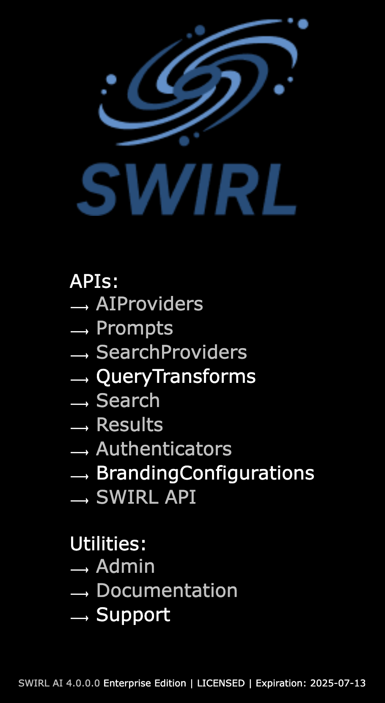
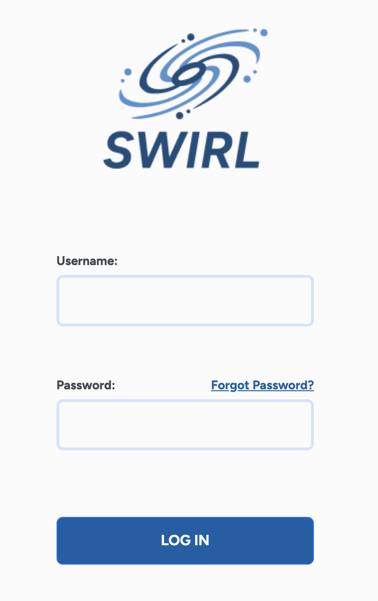

<details markdown="block">
  <summary>
    Table of Contents
  </summary>
  {: .text-delta }
- TOC
{:toc}
</details>

<span class="big-text">Installation Guide</span><br/><span class="med-text">Community Edition</span>

---

{: .warning }
**SWIRL no longer starts Redis automatically.**  
You must have **Redis installed and running** before starting SWIRL.  
Refer to [Install Redis](https://redis.io/docs/latest/operate/oss_and_stack/install/install-redis/) for details.

# System Requirements

- **Platform:** Ubuntu, RHEL, or macOS  
  - Microsoft Windows is **not supported** due to Celery dependencies  
- **Hardware:** 8+ VCPU, 16+ GB RAM  
- **Storage:** 500+ GB free disk space  
- **Python:** 3.11 or newer  

## macOS

- **Python 3.12+** with `pip`
    - Ensure Python runs as `python`, not `python3`  
    - Install **[venv](https://docs.python.org/3/library/venv.html) (optional)**  
    - Install **[pyenv](https://github.com/pyenv/pyenv) (optional)**  
- **Homebrew** installed and updated  
- **Redis installed:**  
  ```shell
  brew install redis
  ```
- **jq installed:**  
  ```shell
  brew install jq
  ```

## Linux

- **Python 3.12+** with `pip`
- **Redis and jq installed:**  
  ```shell
  sudo apt install jq redis-server -y
  ```

## PostgreSQL (optional)

To use PostgreSQL as a **data source** or **SWIRL’s backend database**:

1. Install [PostgreSQL](https://www.postgresql.org/)  
2. Ensure `pg_config` is in your system `PATH`  
3. Install the PostgreSQL driver:
   ```shell
   pip install psycopg2
   ```

## Installing SWIRL AI Search

1. **Clone the repository:**  
   ```shell
   git clone https://github.com/swirlai/swirl-search
   cd swirl-search
   ```

2. **Install SWIRL (macOS):**  
   ```shell
   ./install.sh
   ```

3. **Install SWIRL (Linux):**  
   ```shell
   apt-get update --allow-insecure-repositories -y && apt-get install apt-file -y && apt-file update && apt-get install -y python3-dev build-essential
   ./install.sh
   ```

4. **If `install.sh` fails, install manually:**  
   ```shell
   pip install -r requirements.txt
   python -m spacy download en_core_web_lg
   python -m nltk.downloader stopwords
   python -m nltk.downloader punkt
   ```

{: .warning }
**macOS SSL Issues?** See: [urllib and "SSL: CERTIFICATE_VERIFY_FAILED" Error](https://stackoverflow.com/questions/27835619/urllib-and-ssl-certificate-verify-failed-error/42334357#42334357)

## Setup SWIRL

Run the following command to **initialize SWIRL**:

```shell
python swirl.py setup
```

## Setup RAG

To enable **Real-Time Retrieval Augmented Generation (RAG)**:

```shell
export MSAL_CB_PORT=8000
export MSAL_HOST=localhost
```

See the [RAG Configuration Guide](RAG-Guide.html) for more details.

## Install the Galaxy UI

{: .warning }
To install **Galaxy UI**, you must have the latest **[Docker](https://docs.docker.com/get-docker/)** installed and running.

Run the following command **with Docker running**:

```shell
./install-ui.sh
```

{: .highlight }
**Galaxy UI must be installed only after running** `./install.sh` and `python swirl.py setup`.

## Start SWIRL

To **start SWIRL**, run:

```shell
python swirl.py start
```

## Open the SWIRL Homepage

Visit: [http://localhost:8000/swirl/](http://localhost:8000/swirl/)

  

## Open the Galaxy UI

Visit: [http://localhost:8000](http://localhost:8000) or [http://localhost:8000/galaxy/](http://localhost:8000/galaxy/)

If the search page loads, **log out** to see the login screen:

  

### Log in to SWIRL

- **Username:** `admin`  
- **Password:** `password`  

### Perform a Search

1. Enter a search query in the **search box**.  
2. Click **Search**.  
3. Results will appear in seconds:

  

### Enable RAG (if OpenAI API key is set)

Click **Generate AI Insight**:

  

### Manage SWIRL

Click the **profile avatar (top-right)** → Click **[Manage SWIRL](http://localhost:8000/swirl/)**.

### View Raw JSON Results

- Click **Search** under **API** in the **Manage SWIRL** page.  
- Open: [http://localhost:8000/swirl/search/](http://localhost:8000/swirl/search/)  
- Click **`result_url`** to view the full **JSON response**:

  

## Read More

Refer to the **[SWIRL User Guide](User-Guide.html)** for additional details.
