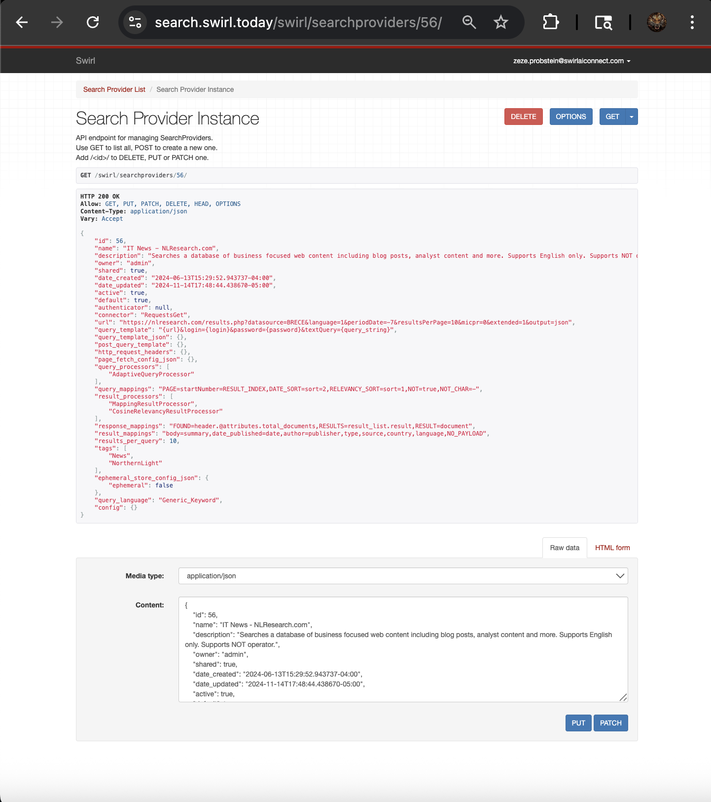

<details markdown="block">
  <summary>
    Table of Contents
  </summary>
  {: .text-delta }
- TOC
{:toc}
</details>

# Quick Start Guide - Enterprise Edition

{: .warning }
This version applies to the Enterprise Edition of SWIRL! A valid license key is required.

* The recommended minimum system configuration is a **16-core server**, with **32 GB of memory** and at least **500 GB of available disk space**. This configuration supports up to **25 users**.

* To run SWIRL in Docker, install the latest version of [Docker](https://docs.docker.com/get-docker/) for macOS, Linux, or Windows. **Ensure Docker is configured to use all available CPU, memory, and storage.**

* You must be logged in to Docker Hub. Open a command-line interface (CLI) and execute the following command, replacing `<docker-username>` and `<docker-password>` with your credentials:

```shell
docker login --username <docker-username> --password <docker-password>
```

* **Windows users** must install and configure either **WSL 2** or the **Hyper-V backend**, as outlined in the [Docker Desktop System Requirements](https://docs.docker.com/desktop/install/windows-install/#system-requirements).

{: .warning }
Ensure Docker is running before proceeding!

## Downloading SWIRL Enterprise Files

1. Locate the email from `hello@swirlaiconnect.com` with the subject **"Try SWIRL Enterprise"**.
2. The email contains three attachments:
   - `Try SWIRL Enterprise with Docker.pdf`
   - `docker-compose.yaml`
   - `env.license`
3. **Save** `docker-compose.yaml` to a folder on the target server.
4. **Rename** `env.license` to `.env.license` and save it in the same folder.

{: .warning }
The leading dot (`.`) in `.env.license` is required!

## Starting SWIRL Enterprise

1. Open a command line and navigate to the folder where `docker-compose.yml` is saved.
2. Run the following command to pull and start the containers:

```shell
docker-compose pull && docker-compose up
```

This starts all services required by SWIRL. Initialization takes a few minutes.

{: .warning }
Do not press `CTRL+C` or stop Docker during this process—doing so will shut down SWIRL.

Once complete, the output should look like this: 


## Verifying SWIRL Startup

1. Open a new command line and check the running containers:

    ```shell
    docker ps
    ```

    The output should look like this:
    

2. Open a browser and navigate to <http://localhost:8000> or <http://localhost:8000/galaxy>  

3. If the search page loads, click `Log Out` in the top-right corner. The login page will appear:

    

4. Log in with:

   - **Username:** `admin`  
   - **Password:** `password`  

5. Enter a search term and press `Search`. The ranked results should appear:

    

    If no results appear or an error occurs, please [contact support](#support).

## Enabling AI Features

{: .warning }
To use **Generate AI Insights** (RAG) or **AI Co-Pilot**, at least one AI provider must be activated.

1. Go to [http://localhost:8000/swirl/aiproviders/](http://localhost:8000/swirl/aiproviders/).
2. Review the **pre-loaded AI providers**.
3. To edit a provider, add its ID to the URL. Example: <http://localhost:8000/swirl/aiproviders/16/>

    

4. Use the **"Raw Data"** form at the bottom to make changes, then click **PUT** to save.

    To function correctly, an AI provider must:

    - Have `"active": true` set.
    - Include `"rag"` and/or `"chat"` in the `"tags"` list.
    - Include `"rag"` and/or `"chat"` in the `"default"` list.
    - Have a valid API key (if required).

5. To create a new provider, **copy an existing one** and paste it as a new entry.

    To use **different AI providers** for **RAG and AI Co-Pilot**, adjust the `"defaults"` list:

    - Example:  
      - **OpenAI GPT-4** → `"defaults": ["rag"]`
      - **Azure/OpenAI GPT-4o** → `"defaults": ["chat"]`

6. Once an active provider for **RAG** exists, click **Generate AI Insights**.

    

7. To access **SWIRL AI Co-Pilot**, visit: [http://localhost:8000/galaxy/chat](http://localhost:8000/galaxy/chat)

8. Ask a question, such as:  
   - *"What sources do I have access to?"*  

9. Conduct a search and verify that **RAG results** appear:

    

## Security Notice

SWIRL ships with a default **admin/password** login. **If using Google Chrome, a security warning may appear.**

To change the password, follow these steps: [Admin Guide - Changing Password](https://docs.swirl.today/Admin-Guide.html#changing-a-super-user-password)

## Stopping SWIRL

To stop SWIRL, use one of these methods:

1. **Via Docker Desktop:**
   

2. **Using CTRL-C in the terminal:**
   

3. **Via a separate terminal:**

```shell
docker-compose stop
```

   

These methods **preserve** the SWIRL database. If you don't need to save data, press `CTRL-C` **twice** to stop SWIRL instantly.

## Optional Steps

- Click **Select Items** to modify documents used for RAG.
- View raw JSON results at:
  - [http://localhost:8000/swirl/search/](http://localhost:8000/swirl/search/)
  - Click `result_url` to view the full JSON response.


- Manage SWIRL via **Galaxy UI**:
  - Click the profile avatar (top-right corner).
  - Click **Manage SWIRL** ([http://localhost:8000/swirl/](http://localhost:8000/swirl/)).

## Microsoft 365 Integration

To connect SWIRL with **Microsoft 365**, you need:

- **Admin access** to the Azure/M365 tenant.
- **App registration** in Azure.
- **App ID and secrets** added to SWIRL.

Setup takes ~1 hour. Follow the guide: [Microsoft 365 Integration Guide](https://docs.swirl.today/M365-Guide.html)

For additional support, please [contact SWIRL](#support).

## Persisting Configuration Changes

1. Identify your SWIRL Docker container (`app` in the name):

   

2. Copy the `.env` file outside Docker:

   

3. Stop the containers:

   

4. Modify `docker-compose.yml`:

   **Before:**  
   

   **After:**  
   

5. Restart SWIRL:

```shell
docker-compose pull && docker-compose up
```