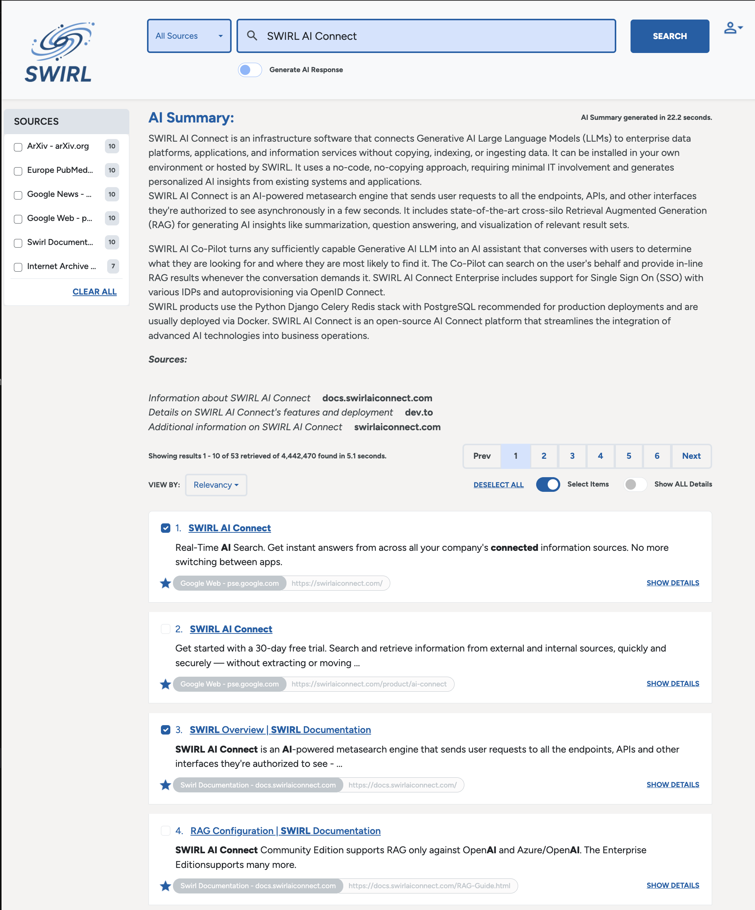

<details markdown="block">
  <summary>
    Table of Contents
  </summary>
  {: .text-delta }
- TOC
{:toc}
</details>

<span class="big-text">Retrieval Augmented Generation (RAG) Configuration</span><br/><span class="med-text">Community Edition</span>

---

SWIRL supports Real-Time **Retrieval Augmented Generation (RAG)** out of the box, using result snippets and/or the full text of fetched result pages.  

# Configuring RAG  

1. **Install SWIRL** as noted in the [Quick Start Guide](./Quick-Start), including the latest version of the **Galaxy UI**.  

2. **Add your OpenAI API key or Azure OpenAI credentials** to the `.env` file:  

    ```shell
    OPENAI_API_KEY='your-key-here'
    ```

    *Check out [OpenAI's YouTube video](https://youtu.be/nafDyRsVnXU?si=YpvyaRvhX65vtBrb) if you don't have an OpenAI API Key.*  

    ```shell
    AZURE_OPENAI_KEY=<your-key>
    AZURE_OPENAI_ENDPOINT=<your-azure-openai-endpoint-url>
    AZURE_MODEL=<your-azure-openai-model>
    ```

    {: .warning }  
    **SWIRL AI Search Community Edition supports RAG only with OpenAI and Azure OpenAI.**  
    The [Enterprise Edition](./AI-Connect#connecting-to-generative-ai-gai-and-large-language-models-llms) supports additional providers.  

3. **For PRODUCTION use**, update `static/api/config/default`:  

    Change this:  
    ```json
    "webSocketConfig": {
        "url": "ws://<yourhost>:<your-port>/chatgpt-data"
    }
    ```  
    ...to this:  
    ```json
    "webSocketConfig": {
        "url": "wss://<yourhost>:<your-port>/chatgpt-data"
    }
    ```  
    *Using `ws://` locally is fine, but it is **not secure** for production!*  

4. **Configure SearchProviders for RAG:**  

    Modify the `page_fetch_config_json` parameter for each **SearchProvider**:  

    ```json
    "page_fetch_config_json": {
        "cache": "false",
        "headers": {
            "User-Agent": "Swirlbot/1.0 (+http://swirl.today)"
        },
        "timeout": 10
    }
    ```  

    - Adjust `timeout` if needed.  
    - Change `User-Agent` if required.  
    - Authorize SWIRL to fetch pages from internal applications.  

    To override the timeout **via the Galaxy UI**, use:  
    ```
    http://localhost:8000/galaxy/?q=gig%20economics&rag=true&rag_timeout=90
    ```  

5. **Restart SWIRL:**  

    ```shell
    python swirl.py restart
    ```  

6. **Run a Search in the Galaxy UI**:  

    - Open [http://localhost:8000/galaxy/](http://localhost:8000/galaxy/).  
    - Ensure the **"Generate AI Response"** switch is **off**.  
    - Search for:  
      ```shell
      http://localhost:8000/galaxy/?q=SWIRL+AI+Connect
      ```  

    Results appear:  
      

7. **Manually Select Results for RAG (Optional)**:  

    - Click **"Select Items"** to enable manual selection.  
    - Pre-selected results indicate **SWIRL's best matches for RAG**.  
    - Check/uncheck results, sort, or filter.  
    - Click **"Generate AI Response"**.  
    - A spinner appears; results follow within seconds.  

      

8. **Verify citations** under the RAG response.  

    {: .highlight }  
    To **cancel** a RAG process, toggle **"Generate AI Summary"** off.  

    {: .warning }  
    By default, **SWIRL's RAG uses the first 10 selected results** (auto or manual).  
    To adjust this, set `SWIRL_RAG_MAX_TO_CONSIDER` in `.env`, as noted in the [AI Search Guide](./AI-Connect#configuration-options).  

# SWIRL RAG Process: 

  

SWIRL's RAG workflow is shown above, and explained below:

1. **Search** - SWIRL sends the users query to one or more SearchProviders, then aggregates and normalizes the results
2. **Re-Rank** - The last step of the Search workflow re-ranks the aggregated, normalized results to find the most relevant results across all sources
3. **Review** - SWIRL supports presenting re-ranked results for review and optional adjustment, prior to executing the rest of the workflow
4. **Fetch** - This involves following the result link and downloading the full text or data set of the result
5. **Read** - SWIRL extracts text from 1,500 file formats then identifies the most relevant passages while chunking it for the next step
6. **Prompt** - SWIRL binds the chunked text to the appropriate prompt, connects to the configured LLM, sends the prompt and waits patiently for the response
7. **Package** - Finally, SWIRL compiles the results, prompt and response and returns it in a neat JSON package, ready for visualization in SWIRL's Galaxy Search UI

### Enterprise RAG Support 
- The **Community Edition** can fetch **publicly accessible sources**.  
- For **RAG with enterprise services** (e.g., Microsoft 365, ServiceNow, Salesforce, Atlassian) with **OAuth2 and SSO**, [contact us for SWIRL Enterprise](mailto:hello@swirlaiconnect.com).  

### Preloaded RAG Configurations  
The following **SearchProviders** come pre-configured for RAG:  

✅ **[European PMC](https://github.com/swirlai/swirl-search/blob/main/SearchProviders/europe_pmc.json)**  
✅ **[Google Web](https://github.com/swirlai/swirl-search/blob/main/SearchProviders/google.json)**  
✅ **[Google News](https://github.com/swirlai/swirl-search/blob/main/SearchProviders/google.json)**  
✅ **[LinkedIn](https://github.com/swirlai/swirl-search/blob/main/SearchProviders/google.json)**  
✅ **[SWIRL Documentation](https://github.com/swirlai/swirl-search/blob/main/SearchProviders/google.json)**  

### API-Based RAG Processing  
RAG processing is available via **a single API call**:  
```
?qs=metasearch&rag=true
```
For details, see the [Developer Guide](./Developer-Guide#get-synchronous-results-with-qs-url-parameter).  

### Configuring Timeout Behavior  
- The **default timeout is 60 seconds**.  
- To modify the timeout and error message, update:  

```json
"webSocketConfig": {
    "url": "ws://localhost:8000/chatgpt-data",
    "timeout": 60000,
    "timeoutText": "Timeout: No response from Generative AI."
}
```  