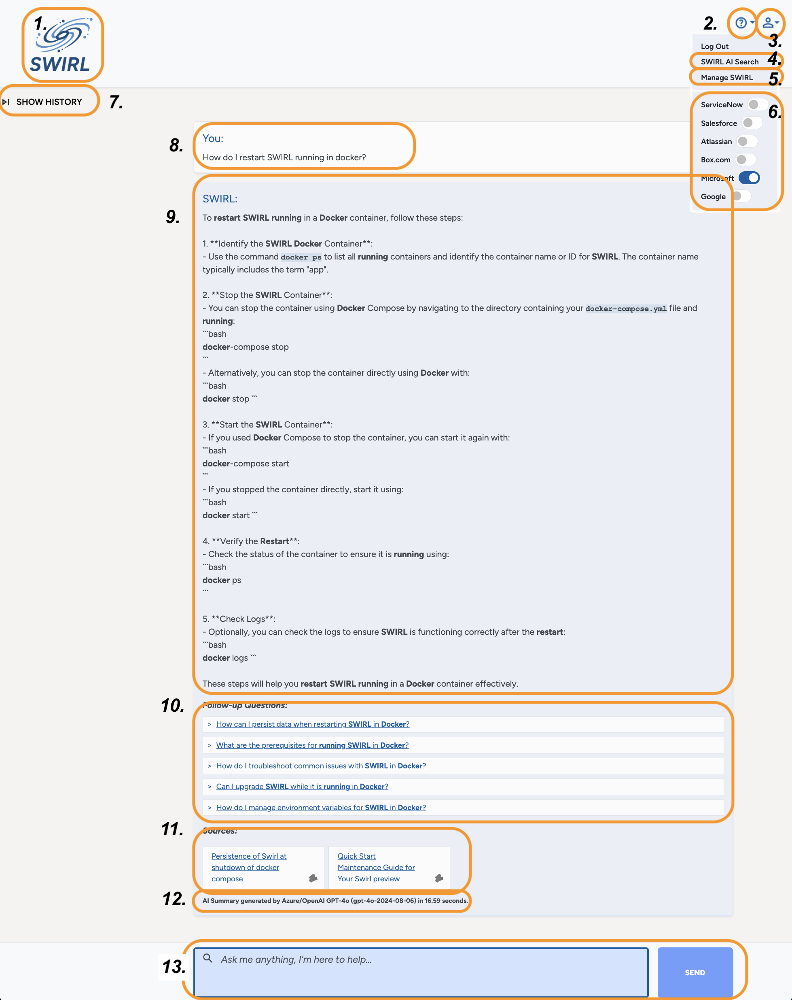
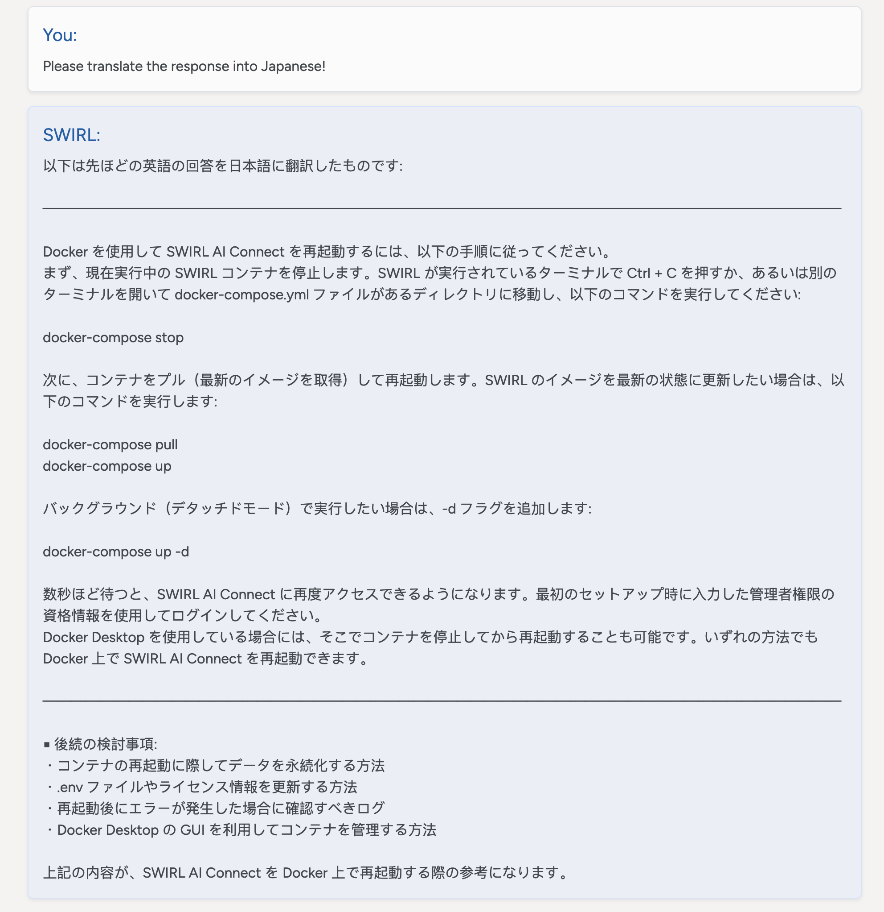
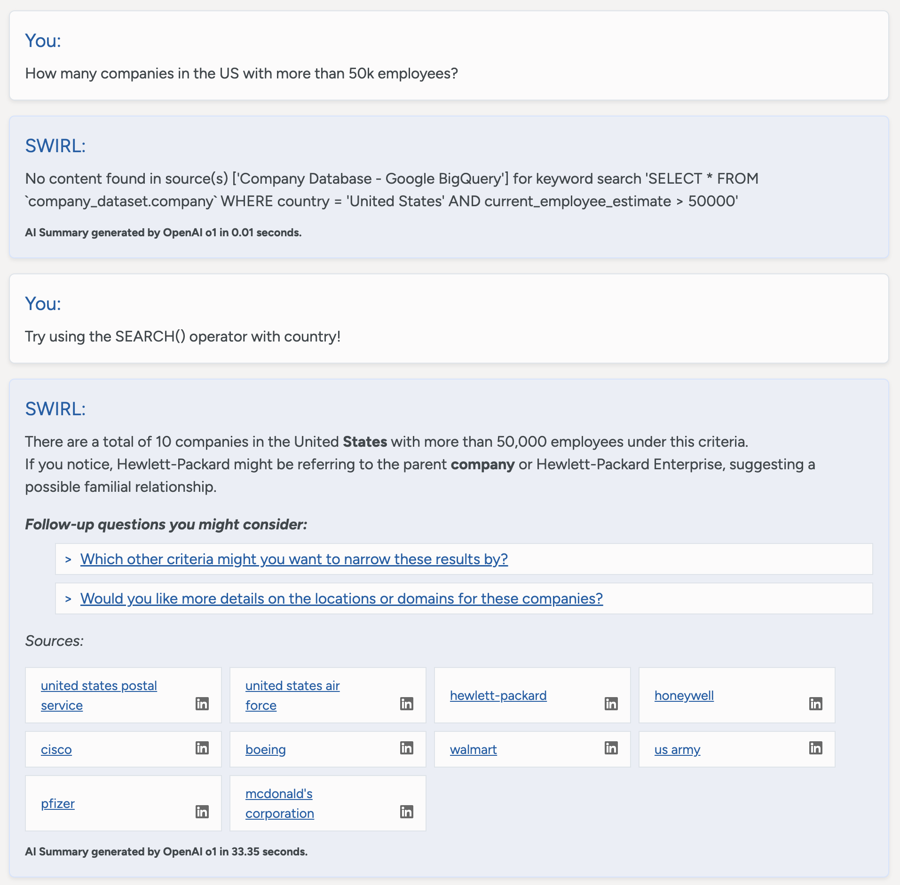
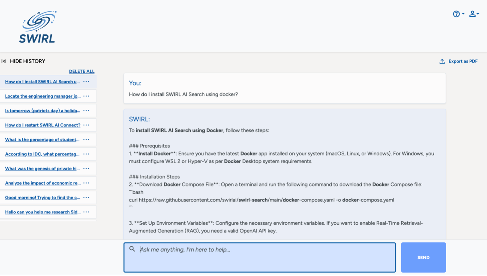
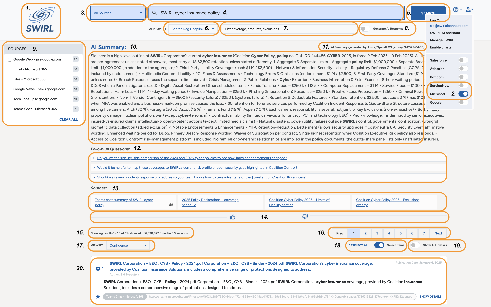
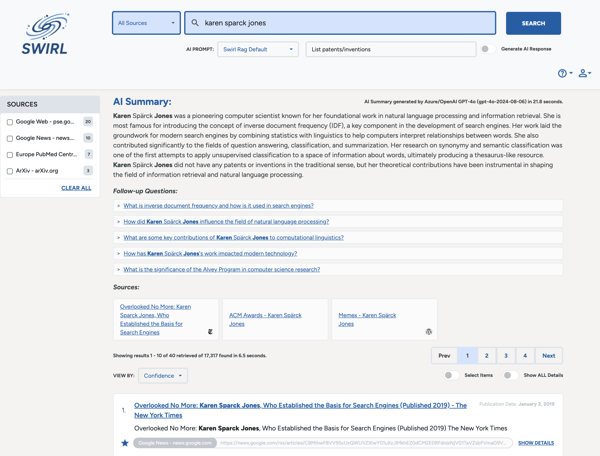

<details markdown="block">
  <summary>
    Table of Contents
  </summary>
  {: .text-delta }
- TOC
{:toc}
</details>

<span class="big-text">User Guide</span><br/><span class="med-text">Enterprise Edition</span>

{: .warning }
Please [contact SWIRL](mailto:hello@swirlaiconnect.com) for access to SWIRL Enterprise.

{: .highlight }
Please note: we've renamed our products! **SWIRL AI Connect** is now **SWIRL AI Search** 🔎 and **SWIRL AI Co-Pilot** is now **SWIRL AI Search Assistant** 🤖

---

# Accessing the SWIRL AI Search Assistant

For local installs, open this URL in a browser: <http://localhost:8000/galaxy/chat/>  

  

## From SWIRL AI Search 

Click the **user profile icon** (top-right) on the [SWIRL Search page](http://localhost:8000/galaxy/search/), then click **"SWIRL AI Search Assistant"**.

  

## Login and Authentication

**If the SWIRL login page appears:**  

  

  - Enter **username:** `admin`  
  - Enter **password:** `password`  
  - Click **`Login`**  

{: .warning }
If you receive a warning about the password being compromised, follow these steps:  
[Change the super user password](./Admin-Guide#changing-the-super-user-password)

### Logging In With SSO

**If your organization uses SSO:**  

The SWIRL login page will show a button for SSO login.  

  

1. Click the **SSO login button**.  
2. You may need to authenticate:  

    

3. Once logged in, you will be redirected to the AI Search Assistant:  

    

## Verifying Authentication

Click the **profile icon** (top-right) to verify your connection to individual sources, which may vary depending on your SSO configuration. 

Use the **toggle switches** to connect or disconnect from any source, as needed.

  

## The AI Search Assistant Explained



1. **SWIRL Logo**. Click on it to reset the form and start over. 

2. **Support Link**. Click the information icon to view the SWIRL version and optionally open a support ticket.

3. **User Profile**. Click the profile icon to view profile management tools, including:

4. **Link to SWIRL AI Search form**. Click the link to [use the search form](#the-ai-search-form-explained) instead of the Assistant.

5. **Manage SWIRL**. Admins may click this link to [Administer SWIRL](Admin-Guide.html#django-console).

6. **View Authentication Status** for each configured source. Click a switch to connect or disconnect. Refer to the [AI Assistant section on Login and Authentication](#login-and-authentication) for more information.

7. **Show/Hide History**. Click to view the chat history and optionally [manage it](#resuming-and-managing-existing-chat-conversations). Click again to hide the history.

8. **Your First Message** in this chat. It will appear at the top of the conversation scroll.

9. **SWIRL's First Response**. It will include:

10. **Follow-up Questions**. Click to view the response/answer.

11. **Citations**. Click to verify the response behind the summary or answer. Web sources may be [deep linked](#deep-linked-citations). If the Search Assistant doesn't provide citations, please rate the response appropriatel, and then instruct it to provide them.

12. **Model and Timing**. This text reports the AI/LLM model used to generate the response, and the time it took to do so.

13. **Message Window**. Use the **input box** and **send button** to talk to the Assistant. It will assist you in finding the information you need. When you and the Assistant agree, it will perform a **search** against one or more sources and either **summarize** the results or **answer your question**.

Read on to learn more about the SWIRL AI Search Assistant's capabilities!

### Understanding Prompts

SWIRL prompts consist of three key components:

| Field | Description |
| ----- | ----------- |
| `prompt` | The main body of the prompt. Use `{query}` to represent the SWIRL query. |
| `note` | Text appended to RAG data chunks, annotated by the [Text Analyzer](#text-summarization). |
| `footer` | Additional instructions appended after the prompt and RAG data. This is ideal for formatting guidance. |

The name of the `prompt` has no importance. SWIRL uses the `tags` field to determine which prompt is used for a given function. 

The following table presents the `tags` options:

| Tag | LLM Role | 
| --- | -------- | 
| chat | Used by AI Search Assistant for chat conversations, including company background; not technical | 
| chat-rag | Used by AI Search Assistant to answer questions and summarize data via RAG; somewhat technical | 
| search-rag | Used by AI Search, `Generate AI Insight` (RAG) switch, somewhat technical | 

### Viewing Prompts

- Any user may view the prompts endpoint: [http://localhost:8000/swirl/prompts/](http://localhost:8000/swirl/prompts/)  

- Admins may use the [Admin Tool - Manage Prompts](http://localhost:8000/admin/swirl/prompt/) interface.

### Modifying Prompts

Administrators can modify prompts, as follows: 
- [Customize the SWIRL AI Search Generate AI Insight RAG prompt](AI-Search.html#customizing-the-ai-search-rag-prompt)
- [Customize the SWIRL AI Search Assistant prompts](AI-Search-Assistant.html#customizing-the-ai-search-assistant-prompts)

## Deep Linked Citations

When possible, the Assistant will link directly to the relevant section of a web page used in a RAG response, and highlight it. 


The first citation is a page on EY.com:


The second citation is on the IMF site:


## Generating Complex Queries

SWIRL Assistant can generate queries in **any query language** supported by the underlying model.  
For example, OpenAI's latest models can generate queries using most **SQL dialects**:

  

Other supported query languages include:

- **MongoDB MQL**
- **OpenSearch**
- **Elastic ESQL**
- **OpenSearch Query DSL**
- **Solr syntax**  
  
{: .highlight }
For assistance with specific query languages, please [contact SWIRL](mailto:support@swirlaiconnect.com).

## Human Language Support

SWIRL Assistant can **converse and query** in any language supported by the underlying model. For example, OpenAI's latest models can converse in **100+ languages**:

  

  

## Other Model Capabilities

SWIRL Assistant does not limit **LLM capabilities**. You can:

- **Summarize** a Assistant chat in various formats (e.g., bullet points, narrative, iambic pentameter), as long as it is within the same chat session.
- **Translate** Assistant responses into other languages.
- **Reformat, revise, or retry** responses.
- **Use memory** to retain information across chat sessions (if supported by the model).

## Handling Errors

Sometimes, Assistant **won't find results**. Don't be alarmed! Try the following:

- **Correct the query**
- **Remove specific terms**
- **Simplify the search**
- **Try a different source**
- **Run the search again**

  

{: .warning }
When querying with **SQL** or other structured query languages, **some models may require occasional correction**:

  

Please [contact support](#support) for assistance using the Assistant with any advanced query language.

## Ending a Chat Conversation

To **end a conversation**, click the **SWIRL logo** at the top of the page. This starts a **new conversation**.

{: .highlight }
Assistant **will not remember** past chat sessions *unless* the model supports memory.

## Resuming and Managing Existing Chat Conversations

To **resume a conversation**, use the "Show/Hide History" link at the top of the Search Assistant page.



Use the controls in the box to delete and rename individual chats. Click the `DELETE_ALL` link to clear your chat history completely.

# Using AI Search

If running locally, access the **Search Interface** here:  
[http://localhost:8000/galaxy/chat/](http://localhost:8000/galaxy/chat/)

## From the AI Search Assistant

From the **Assistant page**, click the **profile button**, then click **"SWIRL AI Search"**:

## The AI Search Form Explained



1. **SWIRL Logo**. Click on it to reset the form and start over. 

2. **User Profile**. Click the profile icon to [view authentication status](#login-and-authentication-1), then click a switch to connect/disconnect from a specific source. Refer to the [AI Assistant section on Login and Authentication](#login-and-authentication) for more information.

3. **Source Selector**. Click to select one or more sources to target for search.

4. **Search Box**. Much larger than it looks. By default, favors results that have you’re your search terms. Feel free to ask questions or query in SQL, MQL, etc if targeting a source that supports it. 

5. **Search Button**. Click to get results for your search, from the selected source(s).

6. **Select AI Prompt**. Click to select a special prompt **before clicking** the `Generate AI Insight` switch.

7. **AI Instructions**. Use this to provide instructions to the AI/LLM when generating insight. This input won’t change or alter the search results or item selections you make.

8. **Generate AI Insight switch**. Click to make SWIRL fetch the most relevant (starred) items and provides them to the configured AI/LLM to [generate insight](#guiding-retrieval-augmented-generation-rag-for-ai-insight-generation). 

9. **Source Filter Options**. By default, **SWIRL returns the best results from all available sources**. To filter results, check the desired `Source` boxes. The displayed results will update instantly. Click `Clear All` to reset the filter and view all results.  

10. **AI Summary**. This is where an AI/LLM insight will appear, typically in 15+ seconds. 

11. **AI Summary Model & Timing**. Provides the name of the model responding, and how long the response took to generate.

12. **AI Generated Follow-Up Questions**. Click one to view the answer, in 15+ seconds.

13. **AI Summary Citations**. Click to verify the results, with deep linking on many sources.

14. **Summary Rating**. Click the “thumbs-up” or “thumbs-down” to provide feedback on AI messages. (Please select and/or fill-in the reason(s) why, if asked.)

15. **Result Summary & Timing**. Sumarizes the number of results, and how long it took to re-rank them.

16. **Page Navigation**. Use to page through search results. Note, you must run a new search if you run out of results. The [SWIRL Administrator can increase the number of results](Developer-Guide.html#increase-available-results) retrieved from each source.

17. **Result Sort Selector**. By default, SWIRL sorts by [Confidence Score](#confidence-scores). Use `Date` to see the latest, and `Top Pick` to see the best from each responding source. Note that when sorting by date, results with no `date_published` field are hidden.

18. **Select Items & DESELECT switch**. Click to select individual results to use when [Generating AI Insights](#guiding-retrieval-augmented-generation-rag-for-ai-insight-generation).

19. **Show ALL Details switch**. Click to show any hidden result field(s). 

20. **Result Item**. Each result may inclucde a linked title,snippet of text that matched your query from the source, the author's name, the date published and/or retrieved, the result type and URL, a “highly relevant” star (when appropriate), a shopping cart selection checkbox and a “SHOW DETAILS” link.

Read on for more information about these capabilities.

## Search Syntax  

The following table details SWIRL's search syntax:  

| Syntax | Handling | Notes |  
| ---------- | ---------- | ---------- |  
| **AND, OR** | Passed down to all SearchProviders | SWIRL does not modify or verify whether a provider supports these operators. |  
| **NOT, -term** | Passed down to configured SearchProviders and rewritten if necessary; removed for providers that do not support `NOT` or `-term` | SWIRL verifies compliance and **down-weights or flags responses** that contain terms excluded by `NOT`. |  
| **tag:term** | Passes `term` to SearchProviders configured with that **Tag** in their `tags` field. The untagged portion of the query is discarded. If a query starts with `tag:`, only providers with that Tag are searched. | **Example:** `electric vehicle company:tesla` → Only the term **`tesla`** is sent to SearchProviders with the `company` Tag.<br/> **Example:** `company:facebook` → The query **`facebook`** is only sent to SearchProviders with the `company` Tag. |  

### AND, OR

- **AND** and **OR** operators are **passed unchanged** to all SearchProviders.  
- SWIRL does **not** verify whether a provider supports these operators or correctly applies them.  

### NOT (`NOT` and `-` Syntax)  

- `NOT` remains in queries for SearchProviders that have **`NOT=True`** in their `query_mappings`.  
  - The `NOT` operator applies to **all terms that follow it** (if the provider supports it).  

- `NOT` is rewritten as `-term` for SearchProviders that have:  
  - **`NOT_CHAR=-`** and **`NOT=False`** (or `NOT` unspecified).  
  - The `-term` applies to all terms that follow it.  

- **For SearchProviders without `NOT=True`**, `NOT` and its associated terms are **removed from the query**.  

- SWIRL **scans responses** for compliance with `NOT` statements.  
  - If a response **contains excluded terms**, its **relevancy score is reduced**.  

### Plus/Minus (`+/-`) Syntax 

- **`+` (PLUS) before a term** ensures it **must** be included in results.  
  - It is **passed unchanged** to all SearchProviders.  

- **`-` (MINUS) before a term** functions as `NOT` **for providers that support it**.  
  - If a provider has **`NOT_CHAR=-`** configured in `query_mappings`, `-term` is passed unchanged.  
  - If a provider has **`NOT=True`** but **not** `NOT_CHAR=-`, `-term` is rewritten to `NOT term`.  

- **For providers without `NOT_CHAR=-`**, all `-term` exclusions are **removed** from the query.  

## Using Tags to Select SearchProviders  

**Tags** categorize **SearchProviders** by topic, entity type, or relevant concepts (e.g., `company`, `person`, `financial`).  
These tags can:  
- **Filter SearchProviders**—Only tagged providers are selected when a query starts with `tag:`.  
- **Direct query terms**—SWIRL rewrites portions of the query based on the provider's tags.  

For example, the **funding dataset** included with SWIRL has SearchProviders for **SQLite3, PostgreSQL, and Google BigQuery**, each containing relevant **Tags**:  

```json
{
    "name": "Company Funding Records (cloud/BigQuery)",
    "connector": "BigQuery",
    ...
    "tags": [
        "Company",
        "BigQuery"
    ]
}
```

### How Tags Work in Queries  

#### 1. Filtering by Tag Only 
If a query **begins with `tag:`**, only **SearchProviders with that Tag** are selected—regardless of their `default` status.  

```shell
company:facebook
```
- This limits the query to **SearchProviders with the `company` Tag**.  
- Unrelated providers **are excluded**, even if they are `default=true`.  

#### 2. Combining a Tag with a General Query
A **default search** can be combined with a **tagged search** for specific terms.  

```shell
electric vehicle company:tesla
```
- **Default SearchProviders** receive the full query: `"electric vehicle tesla"`.  
- **SearchProviders with the `company` Tag** receive only `"tesla"`.  

For example, the **BigQuery SearchProvider** will receive:  

```shell
tesla
```

This makes **direct hits** on funding records more likely to **rank higher** in the results.

## Hit Highlighting  

SWIRL **highlights query term matches** in the following fields:  
- **`title`**  
- **`body`**  
- **`author`**  

For example:  

```json
"body": "<em>Performance</em> <em>management</em> is the process of setting goals and expectations for employees and then tracking and measuring their progress. This can be done through regular one-on-one meetings, <em>performance</em> reviews, and other feedback mechanisms."
```

## Confidence Scores

SWIRL Enterprise uses a **confidence-based relevancy ranking model**. 

The **confidence score** ranges from **0 (not relevant) to 1.0 (extremely relevant)** and is **comparable across queries**.

### How Confidence Scores Work:

The score **factors in**:
  - **Number of matched query terms**
  - **Term importance**
  - **Contextual similarity between the query and the results**
  - **The source-reported rank**
  - **Other advanced ranking factors**

You can still **sort by relevancy** using the **`VIEW BY:`** dropdown. 

**AI Insights use only results** above a configurable minimum confidence score. 

## Managing Prompts

SWIRL prompts consist of three key components:

| Field | Description |
| ----- | ----------- |
| `prompt` | The main body of the prompt. Use `{query}` to represent the SWIRL query. |
| `note` | Text appended to RAG data chunks, annotated by the [Text Analyzer](#text-summarization). |
| `footer` | Additional instructions appended after the prompt and RAG data. This is ideal for formatting guidance. |

### Viewing Prompts

- Any user may view the prompts endpoint: [http://localhost:8000/swirl/prompts/](http://localhost:8000/swirl/prompts/)  

- Admins may use the [Admin Tool - Manage Prompts](http://localhost:8000/admin/swirl/prompt/) interface.

### Modifying Prompts

Request new prompts, or modifications to existing ones, from SWIRL administrators. 

- [Customize the SWIRL AI Search Assistant prompts](AI-Search-Assistant.html#customizing-the-ai-search-assistant-prompt)
- [Resetting SWIRL AI prompts](./Admin-Guide.md#resetting-prompts)

## Guiding Retrieval Augmented Generation (RAG) for AI Insight Generation

SWIRL Enterprise 4.2 includes a new field on the search form: `Optional instructions for the AI response`. This field allows you to provide instructions to the LLM that will summarize the retrieved results - without having it be part of the selection criteria. The search box with the hint "What are you searching for today" determines which results are retrieved. 

For example, this query selects the top documents about Karen Sparck Jones, and instructs the configured LLM to report on major inventions.



The RAG result includes [details of her invention of TF/IDF](https://en.wikipedia.org/wiki/Tf%E2%80%93idf) as expected.

### Using the Shopping Cart

Click `Select Items` to manually select the result to use during RAG.


Use the `DESELECT ALL` / `SELECT ALL` link to check or uncheck all results, then further adjust as desired. 

Click the `Generate AI Insights` switch to send the selected items to the AI/LLM for response.

## Deep Linked Citations

When possible, AI Insights generated using the Search form will deep link directly to the relevant section of a result used in a RAG response, and highlight it. 

Refer to the [section on Deep Linking](#deep-linked-citations) above for more information.

## Starting a New Search  

Click the **SWIRL logo** to reset the search form and start over.


