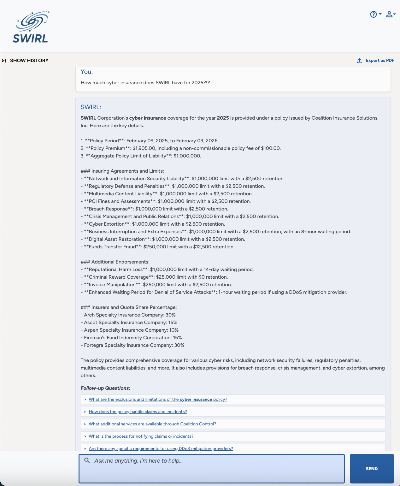
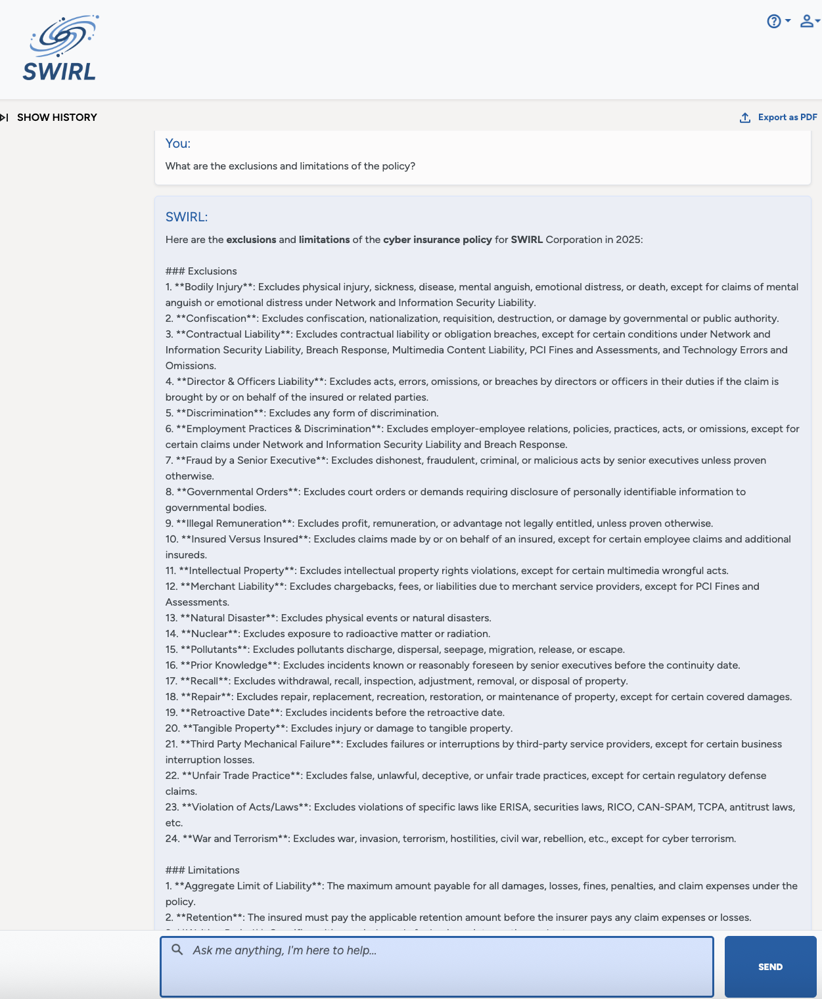
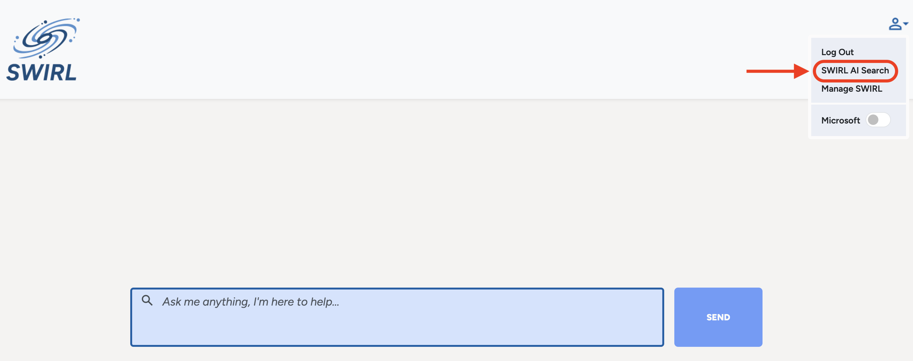
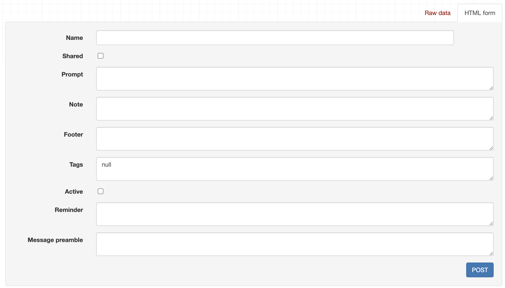

  

    Table of Contents
  

  {: .text-delta }
- TOC
{:toc}

User Guide Enterprise Edition

{: .warning }
Please [contact SWIRL](mailto:hello@swirlaiconnect.com) for access to SWIRL Enterprise.

---

{: .highlight }
If you're looking for SWIRL AI Connect and AI Co-Pilot, you're in the right place.
Those products have been renamed...

# Glossary

The following terms are used when referring to **SWIRL Enterprise** products.

| Term | Explanation | 
| ---------- | ---------- |
| **AIProvider** | A configuration of a Generative AI or LLM. It includes metadata identifying the type of model used, API key, and more. *(Enterprise Edition only)* |
| **Chat** | A SWIRL object that stores message objects for the AI Search Assistant. | 
| **Confidence** | A prediction of the **relevancy** of a SWIRL result, ranging from **0 to 1**. | 
| **Message** | A SWIRL object containing a message, either **to or from** a GAI/LLM. | 
| **Prompt** | A SWIRL object that configures a GAI or LLM for use in various **AI roles**, such as **RAG or chat**. *(Enterprise Edition only)* |

# Accessing AI Search Assistant

* Open this URL in a browser: <http://localhost:8000/galaxy/chat/>  

  

* Alternatively, click the **user profile icon** (top-right) on the [SWIRL Search page](http://localhost:8000/galaxy/search/), then click **"SWIRL AI Search Assistant"**.

  

## SWIRL Login

**If the SWIRL login page appears:**  

  

  - Enter **username:** `admin`  
  - Enter **password:** `password`  
  - Click **`Login`**  

{: .warning }
If you receive a warning about the password being compromised, follow these steps:  
[Change the super user password](./Admin-Guide#changing-the-super-user-password)

## SSO Login

**If your organization uses SSO:**  

The SWIRL login page will show a button for SSO login.  

  

1. Click the **SSO login button**.  
2. You may need to authenticate:  

    

3. Once logged in, you will be redirected to the AI Search Assistant:  

    

# Verifying Connectivity 

Click the **profile icon** (top-right) to verify your connection to individual sources, which may vary depending on your SSO configuration. 

Use the **toggle switches** to connect or disconnect from any source, as needed.

  

# Starting a Conversation

Use the **input box** to send a message to the Assistant. It will assist you in finding the information you need. When you and the Assistant agree, it will perform a **search** against one or more sources and either **summarize** the results or **answer your question**.

  

# Follow-up Questions

The Assistant will often suggest **follow-up questions**. Click one to view the answer!

  

# Generating Complex Queries

SWIRL Assistant can generate queries in **any query language** supported by the underlying model.  
For example, OpenAI's latest models can generate queries using most **SQL dialects**:

  

Other supported query languages include:

- **MongoDB MQL**
- **OpenSearch**
- **Elastic ESQL**
- **OpenSearch Query DSL**
- **Solr syntax**  
  
{: .highlight }
For assistance with specific query languages, please [contact SWIRL](mailto:support@swirlaiconnect.com).

# Human Language Support

SWIRL Assistant can **converse and query** in any language supported by the underlying model. For example, OpenAI's latest models can converse in **100+ languages**:

  

  

# Other Model Capabilities

SWIRL Assistant does not limit **LLM capabilities**. You can:

- **Summarize** a Assistant chat in various formats (e.g., bullet points, narrative, iambic pentameter), as long as it is within the same chat session.
- **Translate** Assistant responses into other languages.
- **Reformat, revise, or retry** responses.
- **Use memory** to retain information across chat sessions (if supported by the model).

# Handling Errors

Sometimes, Assistant **won't find results**. Don't be alarmed! Try the following:

- **Correct the query**
- **Remove specific terms**
- **Simplify the search**
- **Try a different source**
- **Run the search again**

  

{: .warning }
When querying with **SQL** or other structured query languages, **some models may require occasional correction**:

  

Please [contact support](#support) for assistance using the Assistant with any advanced query language.

# Ending a Conversation

To **end a conversation**, click the **SWIRL logo** at the top of the page. This starts a **new conversation**.

{: .highlight }
Assistant **will not remember** past chat sessions *unless* the model supports memory.

# Resuming an Old Conversation

To **resume a conversation**, construct the chat session URL using the `chat_id`:

[http://localhost:8000/galaxy/chat/?chat_id=1](http://localhost:8000/galaxy/chat/?chat_id=1)

{: .highlight }
**Future versions of SWIRL Galaxy** will include direct access to previous chats from the UI.

# Using AI Search

To access the **Search Interface**, open the following URL:  
[http://localhost:8000/galaxy/chat/](http://localhost:8000/galaxy/chat/)

Alternatively, from the **Assistant page**, click the **profile button**, then click **"SWIRL AI Search"**:

  

**Login and authentication remain the same.** If you are already logged into **Assistant**, you **will remain logged in** when using search.

  

## Confidence Scores

Starting in **SWIRL Enterprise 4.0**, SWIRL introduces a **confidence-based relevancy ranking model**. The **confidence score** ranges from **0 (not relevant) to 1.0 (extremely relevant)** and is **comparable across queries**.

### How Confidence Scores Work:

The score **factors in**:
  - **Number of matched query terms**
  - **Term importance**
  - **Contextual similarity between the query and the results**
  - **The source-reported rank**
  - **Other advanced ranking factors**

You can still **sort by relevancy** using the **`VIEW BY:`** dropdown. 

**AI Insights use only results** above a configurable minimum confidence score. 

## Customizing Prompts

**SWIRL AI Search (Enterprise Edition)** allows authorized users to **select a specific prompt** when generating AI Insights.

  

### Selecting a Prompt
- Use the **drop-down list** below the search box **before clicking** `Generate AI Insight`.

### Viewing or Editing Prompts
- Open: [http://localhost:8000/swirl/prompts/](http://localhost:8000/swirl/prompts/)  
- Or use the **[Admin UI prompts management](http://localhost:8000/admin/swirl/prompt/)**.

To modify prompts, use the **HTML form** or **Raw Data modes** at the bottom of the page.

  

{: .warning }
**SWIRL recommends not modifying system prompts.** If you need to reset them, follow the  
[Admin Guide section on resetting prompts](Admin-Guide#resetting-prompts).

