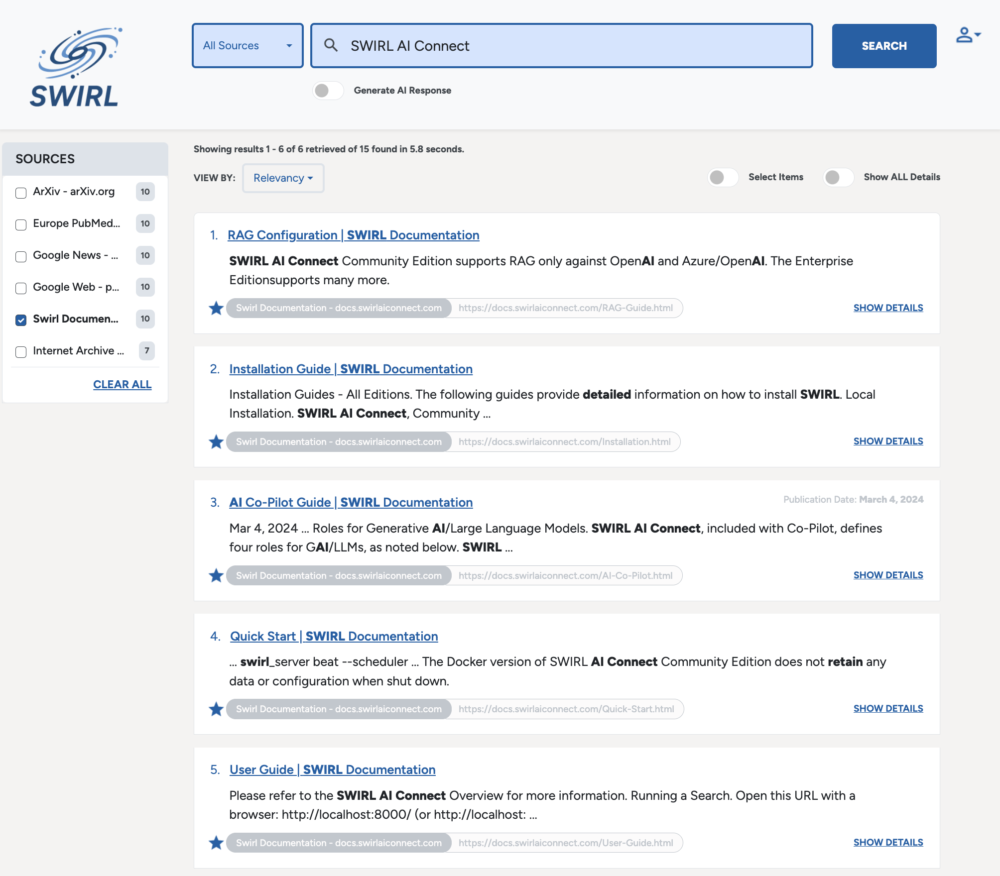
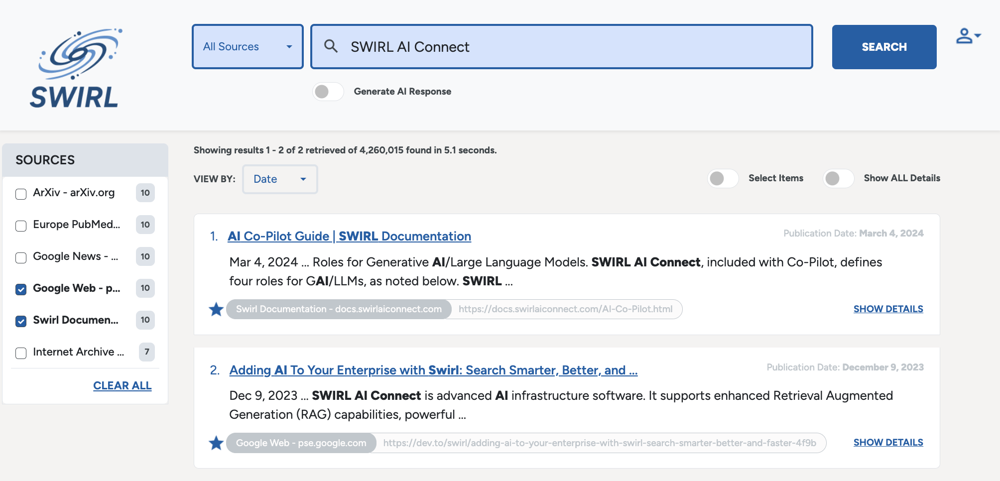

<details markdown="block">
  <summary>
    Table of Contents
  </summary>
  {: .text-delta }
- TOC
{:toc}
</details>

<span class="big-text">User Guide</span><br/><span class="med-text">Community Edition</span>

---

# Glossary  

| Word | Explanation |  
| ---------- | ---------- |  
| **Connector** | A SWIRL module that queries a specific type of data source. |  
| **Page Fetcher** | A SWIRL module that retrieves a copy of a specific document. |  
| **Query** | In search engines, the act of searching is distinct from the search terms themselves, which are called a **query**. SWIRL follows this convention whenever possible. |  
| **Search** | A SWIRL object that **defines a search** to be executed on behalf of a user. It includes the `query_string` (actual search text) and associated metadata. |  
| **SearchProvider** | A configuration of a **Connector**, enabling SWIRL to query a specific endpoint via its API. This includes metadata such as credentials. |  
| **Subscribe** | A key property of **Search** objects. When set to `true`, SWIRL periodically re-runs the search, sorting by date to retrieve new data and removing duplicates. Currently, users must poll for updates, but future releases will support: - **Callbacks** when new results are available.  - **Automatic regeneration of AI Insights.** |  
| **Relevancy Ranking** | A scoring system that determines how relevant a search result is compared to others. Learn more: [Relevance in Information Retrieval](https://en.wikipedia.org/wiki/Relevance_(information_retrieval)). |  

For additional details, refer to the [SWIRL AI Connect Overview](index.html).

# Running a Search  

1. **Open SWIRL in your browser: [http://localhost:8000](http://localhost:8000/)** (or) **[http://localhost:8000/galaxy/search](http://localhost:8000/galaxy/search/)**  

2. **Log in to SWIRL:**  
   - The login page will appear:  

       

   - **Username:** `admin`  
   - **Password:** `password`  

    {: .warning }  
    If you receive a warning about the password being compromised or part of a known data breach, you can safely ignore it by clicking `OK`. However, it's recommended to [change the superuser password](Admin-Guide.html#changing-a-super-user-password).

3. **Enter your search terms** in the search box and click `Search`.  
   - SWIRL will return **re-ranked results** in just a few seconds:  

       

{: .highlight }  
The **Galaxy UI highlights** results with a `swirl_score` above a configurable threshold.  

{: .highlight }  
**SWIRL Community Edition retrieves a single set of results** per **SearchProvider** configuration.  Fetching additional result pages on demand is planned for a future release. 

## Filtering Results by Source  

  

By default, **SWIRL returns the best results from all available sources**. To filter results, check the desired `Source` boxes as shown above. Results update instantly.  

Click `Clear All` to reset the filter and view all results.  

## Sorting Results  

  

By default, **SWIRL Community sorts results by relevancy score**. To change this:  

- Click the **`View By`** dropdown.  
- Select:  
  - **`Date`** – Sorts results chronologically. Results without a `date_published` value are hidden.  
  - **`Top Picks`** – Highlights the most relevant results from each source.  

To see all results again, switch back to **`Relevancy`** sorting.  

## Starting a New Search  

Click the **SWIRL logo** to reset the search form and begin a new search.  

## Search Syntax  

The following table summarizes SWIRL's support for common search syntax:  

| Syntax | Handling | Notes |  
| ---------- | ---------- | ---------- |  
| **AND, OR** | Passed down to all SearchProviders | SWIRL does not modify or verify whether a provider supports these operators. |  
| **NOT, -term** | Passed down to configured SearchProviders and rewritten if necessary; removed for providers that do not support `NOT` or `-term` | SWIRL verifies compliance and **down-weights or flags responses** that contain terms excluded by `NOT`. |  
| **tag:term** | Passes `term` to SearchProviders configured with that **Tag** in their `tags` field. The untagged portion of the query is discarded. If a query starts with `tag:`, only providers with that Tag are searched. | **Example:** `electric vehicle company:tesla` → Only the term **`tesla`** is sent to SearchProviders with the `company` Tag.<br/> **Example:** `company:facebook` → The query **`facebook`** is only sent to SearchProviders with the `company` Tag. |  

### AND, OR

- **AND** and **OR** operators are **passed unchanged** to all SearchProviders.  
- SWIRL does **not** verify whether a provider supports these operators or correctly applies them.  

### NOT (`NOT` and `-` Syntax)  

- `NOT` remains in queries for SearchProviders that have **`NOT=True`** in their `query_mappings`.  
  - The `NOT` operator applies to **all terms that follow it** (if the provider supports it).  

- `NOT` is rewritten as `-term` for SearchProviders that have:  
  - **`NOT_CHAR=-`** and **`NOT=False`** (or `NOT` unspecified).  
  - The `-term` applies to all terms that follow it.  

- **For SearchProviders without `NOT=True`**, `NOT` and its associated terms are **removed from the query**.  

- SWIRL **scans responses** for compliance with `NOT` statements.  
  - If a response **contains excluded terms**, its **relevancy score is reduced**.  

### Plus/Minus (`+/-`) Syntax 

- **`+` (PLUS) before a term** ensures it **must** be included in results.  
  - It is **passed unchanged** to all SearchProviders.  

- **`-` (MINUS) before a term** functions as `NOT` **for providers that support it**.  
  - If a provider has **`NOT_CHAR=-`** configured in `query_mappings`, `-term` is passed unchanged.  
  - If a provider has **`NOT=True`** but **not** `NOT_CHAR=-`, `-term` is rewritten to `NOT term`.  

- **For providers without `NOT_CHAR=-`**, all `-term` exclusions are **removed** from the query.  

## Using Tags to Select SearchProviders  

**Tags** categorize **SearchProviders** by topic, entity type, or relevant concepts (e.g., `company`, `person`, `financial`).  
These tags can:  
- **Filter SearchProviders**—Only tagged providers are selected when a query starts with `tag:`.  
- **Direct query terms**—SWIRL rewrites portions of the query based on the provider's tags.  

For example, the **funding dataset** included with SWIRL has SearchProviders for **SQLite3, PostgreSQL, and Google BigQuery**, each containing relevant **Tags**:  

```json
{
    "name": "Company Funding Records (cloud/BigQuery)",
    "connector": "BigQuery",
    ...
    "tags": [
        "Company",
        "BigQuery"
    ]
}
```

### How Tags Work in Queries  

#### 1. Filtering by Tag Only 
If a query **begins with `tag:`**, only **SearchProviders with that Tag** are selected—regardless of their `default` status.  

```shell
company:facebook
```
- This limits the query to **SearchProviders with the `company` Tag**.  
- Unrelated providers **are excluded**, even if they are `default=true`.  

#### 2. Combining a Tag with a General Query
A **default search** can be combined with a **tagged search** for specific terms.  

```shell
electric vehicle company:tesla
```
- **Default SearchProviders** receive the full query: `"electric vehicle tesla"`.  
- **SearchProviders with the `company` Tag** receive only `"tesla"`.  

For example, the **BigQuery SearchProvider** will receive:  

```shell
tesla
```

This makes **direct hits** on funding records more likely to **rank higher** in the results.

### Example Response from BigQuery SearchProvider

```json
"results": [
    {
        "swirl_rank": 1,
        "swirl_score": 1316.565600582163,
        "searchprovider": "Company Funding Records (cloud/BigQuery)",
        "searchprovider_rank": 1,
        "title": "*Tesla* Motors",
        "url": "tesla-motors",
        "body": "*Tesla* Motors raised $40000000 series C on 2006-05-01. *Tesla* Motors is located in San Carlos, CA, and has 270 employees.",
        "date_published": "2006-05-01 00:00:00",
        "date_retrieved": "2023-01-11 12:16:43.302730",
        "author": "",
        "payload": {},
        "explain": {
            "stems": "tesla",
            "title": {
                "tesla_*": 0.8357298742623626,
                "Tesla_0": 0.8357298742623626,
                "result_length_adjust": 4.5,
                "query_length_adjust": 1.0
            },
            "body": {
                "Tesla_0": 0.7187157993182859,
                "result_length_adjust": 1.25,
                "query_length_adjust": 1.0
            }
        }
    }
]
```

### Notes 

- **Tagged SearchProviders receive a rewritten query** with only the terms that follow `tag:`.  
- **Other SearchProviders** receive the **full original query**.  
- **SearchProviders do not need `default=true` for Tags to work.**  
  - As long as they are **`active=true`**, using a tag in a query will **invoke them**.  

For more details, refer to the [**Organizing SearchProviders with Active, Default, and Tags**](SP-Guide.html#organizing-searchproviders-with-active-default-and-tags) section.  

# Relevancy Ranking  

SWIRL generates a **unified result set** by aggregating results from all responding **SearchProviders**.  

Relevancy ranking is determined by:  
- **Stemmed word matching** to improve recall.  
- **Cosine vector similarity scoring** using **[spaCy](https://spacy.io/)** for semantic relevance.  
- **Normalization by query length and token count** to ensure fair scoring across queries.  
- **Incorporation of the original `searchprovider_rank`** to maintain provider-specific relevance.  

The **Galaxy UI** puts a star next to results that exceed a configurable relevancy threshold, making high-confidence matches more visible.  

For more details, see:  
- [Adjusting the SWIRL Score](Developer-Guide.html#adjusting-the-swirl_score-that-causes-galaxy-ui-to-star-results)  
- [Configuring Relevancy Field Weights](Developer-Guide.html#configure-relevancy-field-weights)  
- [Understanding the Explain Structure](Developer-Guide.html#understand-the-explain-structure)  

## Hit Highlighting  

SWIRL **highlights query term matches** in the following fields:  
- **`title`**  
- **`body`**  
- **`author`**  

For example:  

```json
"body": "<em>Performance</em> <em>management</em> is the process of setting goals and expectations for employees and then tracking and measuring their progress. This can be done through regular one-on-one meetings, <em>performance</em> reviews, and other feedback mechanisms."
```

## Integrating with Source Synonyms  

SWIRL supports **source synonym configurations** to enhance relevancy calculations and hit highlighting.  

For details, see the Developer Guide: [Integrate Source Synonyms Into SWIRL Relevancy](Developer-Guide.html#integrate-source-synonyms-into-swirl-relevancy)
